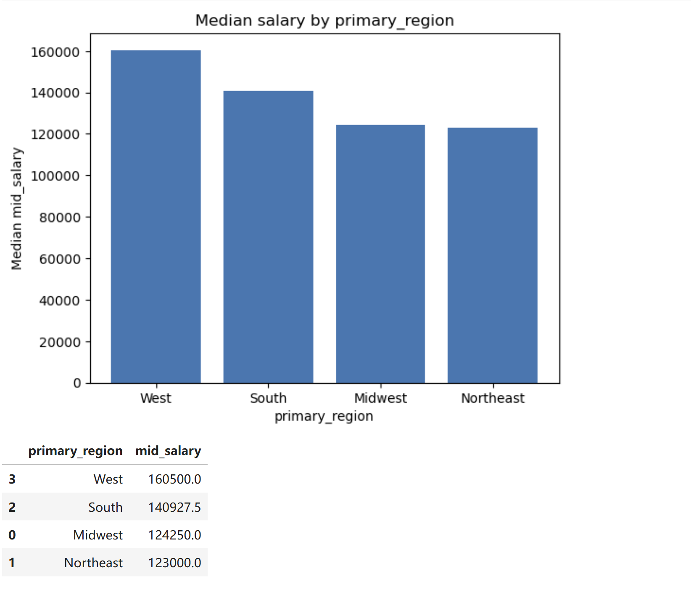
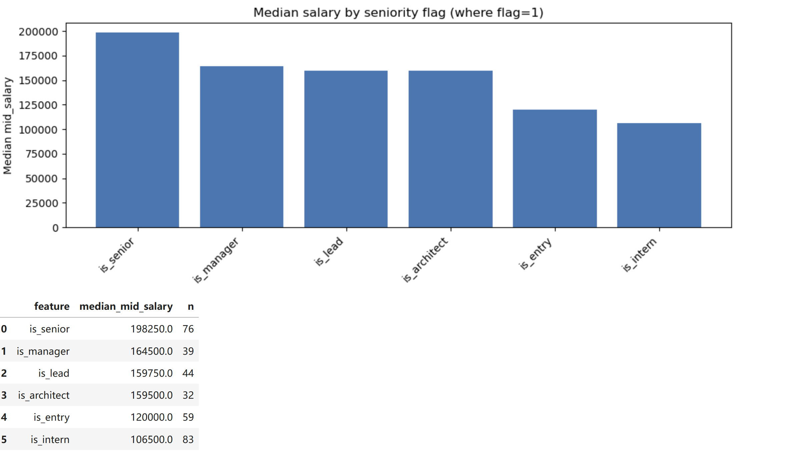
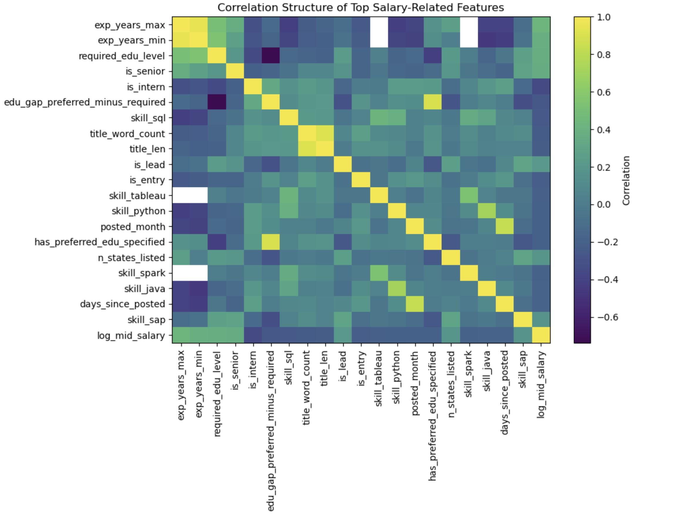
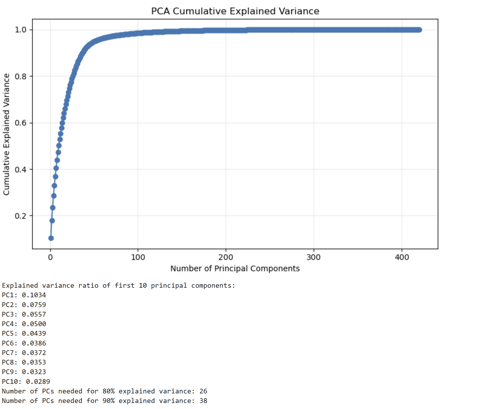
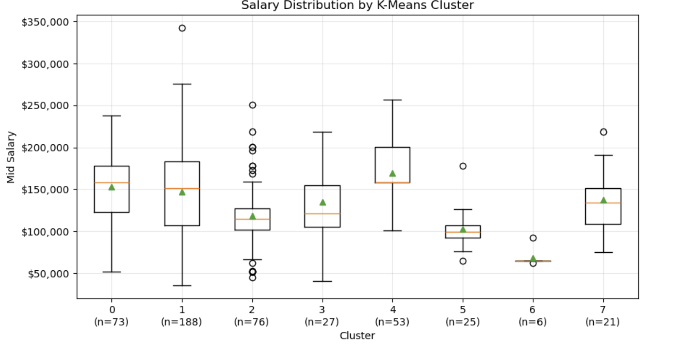

# IBM Job Salary Analysis Project

**GitHub Repository:** [https://github.com/Trigger-chen/5243-project4](https://github.com/Trigger-chen/5243-project4)

**Shiny Dashboard:** [https://baixuanchen5243.shinyapps.io/5243-project4/](https://baixuanchen5243.shinyapps.io/5243-project4/)

Group 16: Baixuan Chen(bc3212), Zhonghao Liu(zl3593), Jisheng Zeng(jz3993), Daisy Zhou(dz2590)

## Introduction
This project documents an end-to-end data science pipeline for predicting salaries from publicly available job postings at IBM. The main research question that we aim to solve with this dataset is: Based on the IBM job posting data, how accurately can we predict salary, and which features are the primary drivers for this prediction? 

Salary transparency has become increasingly important as pay disclosure laws expand across the United States. However, posted salary ranges are often broad and influenced by different factors such as job family, seniority, geographic location, education requirements, and specific technical skills listed in the job description. As a result, it is important to understand how these factors altogether determine compensation, and a predictive model trained on real job posting can serve as both a benchmarking tool and as a way to generate meaningful insights into how a major technology employer structures compensation across its different roles.

To translate this objective into a practical solution, we implement a structured data science pipeline that encompasses data preparation, exploratory analysis, feature engineering, and predictive modeling. 

This report follows the standard data science workflow:

- **Data Acquisition and Preparation**: Scraping IBM job postings, type conversion, formatting normalization, duplicate removal, and missing value handling on the raw data.

- **Exploratory Data Analysis**: Data quality checks, univariate distributions, bivariate and multivariate analysis, time trends, skill keyword frequency, and outlier checks.

- **Data Preprocessing**: Final dataset selection, missing value strategy, rare category handling, categorical encoding, numerical scaling, and leakage prevention before modeling.

- **Feature Engineering**: Creating salary-related variables, date features, location features, ordinal education encodings, seniority indicators from job titles, role-category indicators, and skill flags.

- **Unsupervised Learning**: Using correlation analysis, PCA dimensionality reduction, K-Means clustering, and Isolation Forest outlier detection to understand hidden structure in the job postings.

- **Supervised Learning**: Training Ridge Regression, Random Forest, and Gradient Boosting models to predict log-transformed midpoint salary, with cross-validation, hyperparameter tuning, and held-out test evaluation.

- **Model Comparison and Selection**: Comparing models using RMSE, MAE, and R², while also considering interpretability, robustness, and practical prediction performance to select the final model.

- **Dashboard Development**: Building an interactive Shiny dashboard to present dataset summaries, EDA results, feature engineering outputs, unsupervised learning findings, and supervised modeling results.
## 1. Data Acquisition & Preparation

The dataset was acquired by scraping IBM’s public careers website and was filtered to job postings located in the United States. Because the careers site renders job listings dynamically through JavaScript rather than as a static HTML, a request-based scraper such as BeautifulSoup would not have been sufficient, so we used Selenium to extract its content. All of the code used for acquiring the data is found in ibm_scraping.ipynb. The raw scraped dataset `ibm_jobs_raw.csv` contains 478 rows and 11 columns, with each row representing a single job posting and columns covering structural metadata (i.e. job ID, job title, posting date, state/province), role attributes (area of work, position type), educational requirements (required and preferred), unstructured textual descriptions of preferred technical experience, and posted salary endpoints (min and max salary). Here, salary is the primary outcome of interest. 

**Table 1: Data Dictionary**

| Column | Description |
|:---|:---|
| `job_title` | Job title as posted, such as "Senior Software Engineer". |
| `job_id` | Unique IBM-assigned posting identifier. |
| `date_posted` | Posting date in `DD-MMM-YYYY` format. |
| `state_province` | State or states where the role is based; may contain multiple comma-separated states. |
| `area_of_work` | Business area, such as Software Engineering, Consulting, or Sales. |
| `min_salary` | Projected minimum annual salary in USD. |
| `max_salary` | Projected maximum annual salary in USD. |
| `position_type` | Role level, such as Professional, Entry Level, Internship, or Administration & Technician. |
| `required_education` | Minimum required education, such as Bachelor's Degree. |
| `preferred_education` | Preferred education level; often missing. |
| `preferred_technical_experience` | Free-text description of preferred technical skills; often missing. |

To prepare the raw dataset for downstream analysis, inconsistencies were first addressed. Salary fields were stored as strings with embedded commas, so they were stripped of formatting characters and cast to numeric `min_salary_num` and `max_salary_num` columns. Posting dates, which appear in a “30-Jan-2026” string format, were parsed into a `date_posted_dt` datetime column. Education values were normalized for casing and whitespace to consolidate near-duplicates, and all string fields were trimmed of leading and trailing whitespace. Additionally, two derived numeric features were created: `mid_salary` and `salary_range`. The former represents the midpoint of the posted salary band using the `min_salary_num` and `max_salary_num` columns, while the latter is the spread between the minimum and maximum. 

Salary validity checks also revealed no logical inconsistencies. There were 0 cases where `min_salary_num` exceeded `max_salary_num`, and there were no non-positive salaries either. On the de-duplicated data, `min_salary_num` had a minimum of 29,120 and a mean of 105,427, while `max_salary_num` reached up to 410,000. `mid_salary` had a median of 134,000 and a mean of 141,138. 

Furthermore, duplicate value detection revealed seven exact duplicate `job_id` values which were likely a byproduct of the web scraping process recapturing the same job posting. We removed these duplicate values on `job_id` to produce a final dataset of 471 unique postings used for EDA analysis. 

To initially handle any missing values, any observations missing `min_salary`, `max_salary`, and `job_title` were dropped since a posting’s outcome variable cannot be defined without salary. We also discovered that missingness was concentrated in a small number of columns with `preferred_education` missing in 123 out of 478 rows (25.73%) and with `preferred_technical_experience` missing in 92 out of the 478 rows (19.25%).  Any NaN values in `preferred_technical_experience` were filled with an empty string, while any NaN values in `area_of_work` were replaced with the string “unknown”.  

   
  <em>Figure 1: Missing value counts by column</em>

After initial data cleaning and preparation, the analysis-ready dataset spans a posting window from August 14, 2025 to February 4, 2026 with `min_salary_num` ranging from $29,120 to $275,000 and `max_salary_num` reaching up to $410,000. The median `mid_salary` is approximately $137,000. 

## 2. Exploratory Data Analysis (EDA)

The EDA is structured around four deeper questions:
What does the data look like in terms of quality and structure?
How do individual variables distribute?
How does salary relate to different job attributes?
How do these patterns shift over time?

The objective of this section is to both characterize the dataset and to identify key relationships that should inform the decisions we make for feature engineering and supervised modeling later down the pipeline. All subsequent analyses have been performed on the de-duplicated dataset of 471 unique job postings. 

### Univariate Distributions

The categorical composition of the postings is dominated by professional level roles. As seen in Figure 2, Position type is heavily skewed toward Professional (271 postings, 57.5%) with Internship (100, 21.2%) and Entry Level (90, 19.1%) positions representing smaller shares (Figure 2) . Administration and Technician roles are the rarest with only 10 postings (2.1%). Area of work has a longer tail with the largest categories being Software Engineering, Consulting, and Sales followed by Infrastructure & Technology, Design & UX, and Product Management (Figure 3). The remaining postings are distributed across smaller business areas. 

   
  <em>Figure 2: Total Count by Position Type</em>

   
  <em>Figure 3: Total Count by Area of Work</em>

Education requirements are bimodal where required education clusters around High School Diploma/GED and Bachelor’s Degree and much smaller representation at the Master’s and Doctorate level. Additionally, the `state_province` field is not a clean single-state variable with about 62% of postings listing multiple comma-separated states in a single string. This suggests that these job postings may represent flexible, multi-region, or even remote-eligible recruiting rather than a single fixed location. This has implications for feature engineering, where the `state_province` field cannot be one-hot encoded directly and will instead need to be parsed into derived signals such as a count of states listed and a multi-state indicator. 

   
  <em>Figure 4: Total Count by Required Education</em>

Salary itself is right-skewed as shown in Figure 5. The distribution of `mid_salary` has a long right tail driven by a small number of jobs with extremely high salaries which are tied to senior professional roles. The median sits at around $137,000 with salary levels extending past $300,000. This also has implications for feature engineering where a transformation is required to produce a much more symmetric distribution. Furthermore, as seen in Figure 6, `salary_range` (salary maximum - salary minimum) is also right-skewed with a majority of job postings spanning $50,000 to $90,000 of band width and a median sitting at around $70,000. It can also be seen that only 2 job postings have a fixed salary point where the range is 0. 

   
  <em>Figure 5: Distribution of mid_salary</em>

   
  <em>Figure 6: Distribution of salary_range</em>

### Bivariate Relationships and Statistical Tests

Salary differs significantly across all three of the main job-attribute variables: area of work, position type, and required education. However, the magnitude of the gap differs across them. 

Across the top 8 areas of work, it can be seen that Consulting and Software Engineering sit at the high end with median `mid_salary` of approximately $157,000 and $154,000, respectively (Figure 7). Infrastructure & Technology on the other hand shows a noticeably lower median than the other groups. Because the salary distribution is visibly right skewed and variance fluctuates across the different groups, we conducted a Kruskal-Wallis test where the resulting H and p-values were 67.25 and 5.30e-12 respectively. A small p-value suggests that there is very strong evidence that the differences in `mid_salary` across business areas reflect a real pattern in IBM’s compensation rather than random sampling variation. 

   
  <em>Figure 7: mid_salary Distribution by area_of_work</em>

Across position types, the difference in salary levels is noticeably greater (Figure 8). Professional roles have a median of around $173,000, while Entry level positions have a median of around $113,000. Conducting another Kruskal-Wallis test shows that H is approximately 295.37 and p is approximately 9.99e-64 which suggests that position type is an important driver of compensation in this dataset. 

   
  <em>Figure 8: mid_salary Distribution by position_type</em>

Across required education, there is a clear ordinal pattern with High School Diploma/GED postings having a median around $112,000, Bachelor’s around $158,000, and Master’s around $196,500 (Figure 9). The Doctorate group has the highest median but with very few postings, and the Kruskal-Wallis test is again significant. Because education is naturally ordered, this finding motivates the need for encoding required education and preferred education as ordinal levels in feature engineering rather than one-hot dummy variables. 

   
  <em>Figure 9: mid_salary Distribution by required_education</em>

In addition, we analyze the relationship between `mid_salary` and `salary_range` as shown in Figure 10 which results in a strong positive Pearson correlation (r = 0.81). This means that higher paying job postings also have wider posted bands and aligns with the idea that senior roles allow more compensation flexibility and negotiation. 

   
  <em>Figure 10: salary_range vs mid_salary </em>

Finally, area of work and position type are not independent of each other (Figure 11). We conduct a Chi-Square test with $\chi^2$ = 112.78, dof = 21, p = 1.48e-14 which rejects independence and a Cramer’s V statistic of 0.29 indicates a moderate association. Certain areas such as Consulting are disproportionately professional, while others contain more entry-level and internship positions. This means that salary gaps between business areas come from two sources: real differences in pay across areas, and some areas hire more senior individuals than others. This is an important finding that would be accommodated in the modeling stage. 

   
  <em>Figure 11: Heat Map of area_of_work x position_type</em>

### Skill Keyword Analysis
The unstructured `preferred_technical_experience` field was tokenized using a curated vocabulary of single-world and multi-word skill terms, and phrases like “machine learning” matched before single tokens to avoid double counting. As shown in Figure 12, among the 470 postings with a valid `mid_salary`, AI-related keywords lead with “ai” appearing in 14.3% of postings followed by “agile” (10.6%), “python” (9.1%), and “aws” (7.4%). The prominence of AI keywords is consistent with IBM’s recent strategic emphasis on generative AI, and the broader top-10 keywords reflect a focus on and need for cloud and data engineering skills. 

   
  <em>Figure 12: Top 20 Skill Keywords in Preferred Technical Experience</em>

A comparison of median salary “with skill mentioned” vs. “without skill mentioned” shows that 9 of the top 10 skills have a negative median salary difference (Figure 13). For example, the gap for Linux and Python exceeds $30,000. This reveals possible confounding-by-missingness rather than a result of true skill devaluation. As seen in the data quality section, approximately 19% of postings have `preferred_technical_experience` missing, and this missing count is concentrated in higher paying non-technical roles. More specifically, approximately 30% are missing in Consulting, 24% in Sales, and 24% among Professional-level postings. The “without skill” reference group is therefore heavily weighted toward senior, high-paid, non-technical postings which inflates the baseline. SAP is seen as an exception because it is the one skill in the top 10 concentrated in those higher paid Consulting roles. 27 of 31 SAP postings are in Consulting, and 26 of these 31 are also at the Professional level, dominated by Senior Management Consultant titles. This is an important finding for modeling: skill-salary marginals from this raw text field reflect role composition more than skill value. Therefore, skills should be brought into the model as binary indicator features which can be seen later in Section 6.7 of the jupyter notebook. 

   
  <em>Figure 13: Median Salary Difference by Top 10 Skill Mentions</em>

### Time Trends and Outlier Checks 

Posting volume is heavily concentrated near the end of the observation window, with January 2026 alone accounting for 261 of the 469 postings (55%) and the earlier months are substantially sparser. The weekly view in Figure 14 confirms a sharp increase in job postings. Counts climbed from 27 in the week of January 5, 2026 to 58, 61, and 115 in successive weeks, peaking at the end of February. It is important to note however that the current data listed on the IBM website is not the same as the data we used for the project which was scraped from the website at an earlier time. This implies that older postings tend to be filled and removed before the web scrape runs. Therefore, monthly time trends should be interpreted as short-run level shifts rather than long-run trends.

   
  <em>Figure 14: Weekly Posting Counts</em>

The monthly median `mid_salary` follows a similar trajectory where compensation levels hover at around $107,000 in November 2025 before rising to $120,000 in December 2025 and then $155,750 in January 2026 (Figure 15). Salary then drops to $141,000 in February. Because position type is the dominant salary driver and Professional-level postings spike the most during this same January surge (Figure 16), the apparent salary uptrend is likely a compositional effect. January specifically attracts a heavier mix of professional roles and is when companies typically resume their hiring after the holidays. 

   
  <em>Figure 15: Monthly mid_salary Levels</em>

   
  <em>Figure 16: Job Posting Volume by Position Type Over Time</em>

Outlier detection on `mid_salary` using the standard 1.5 IQR rule flags a small number of high end postings with `max_salary_num` reaching $410,000. Manual inspection of the top 10 highest paid job postings confirmed they are primarily senior Consulting and Engineering roles, so they were retained in the dataset. It is also important to note that throughout our EDA, we report medians and quantiles to preserve robustness rather than means. 

**Table 2:** Top 10 highest `mid_salary` postings

| job_id | job_title | date_posted | state_province | area_of_work | position_type | min_salary_num | max_salary_num | mid_salary | salary_range |
|---|---|---|---|---|---|---|---|---|---|
| 89533 | Principal Engineer, Db2 for z/OS | 04-Feb-2026 | California | Software Engineering | Professional | 275,000 | 410,000 | 342,500 | 135,000 |
| 80088 | Software Engineer - Streaming | 03-Feb-2026 | Texas, Massachusetts, California | Software Engineering | Professional | 220,800 | 331,200 | 276,000 | 110,400 |
| 86223 | Ecosystem Technical Strategist | 23-Jan-2026 | Texas, New York, California | Sales | Professional | 162,000 | 378,000 | 270,000 | 216,000 |
| 90520 | Senior Quantum Error Correction Theorist | 03-Feb-2026 | New York | Research | Professional | 219,000 | 296,000 | 257,500 | 77,000 |
| 87906 | Staff Software Engineer - HashiCorp Secure Run... | 27-Jan-2026 | Texas, Massachusetts, California | Software Engineering | Professional | 189,000 | 324,000 | 256,500 | 135,000 |
| 72905 | Senior Digital Asset Sales | 03-Feb-2026 | New York | Sales | Professional | 243,000 | 270,000 | 256,500 | 27,000 |
| 83085 | Staff Engineer - Full Stack - HCP Terraform Founda... | 05-Jan-2026 | Texas, North Carolina, Massachusetts, California | Software Engineering | Professional | 189,000 | 324,000 | 256,500 | 135,000 |
| 72906 | Senior Digital Asset Tech Sales | 20-Jan-2026 | New York | Sales | Professional | 243,000 | 270,000 | 256,500 | 27,000 |
| 81989 | U.S. Public Sector Compliance Officer | 20-Dec-2025 | Texas, New York, Virginia, Alabama, Colorado, ... | Enterprise Operations | Professional | 184,000 | 317,000 | 250,500 | 133,000 |
| 85759 | Industry Quantum Consultant | 12-Jan-2026 | New York | Consulting | Professional | 200,000 | 280,000 | 240,000 | 80,000 |

Lastly, a final missingness check showed that the missingness rates of `preferred_education` and `preferred_technical_experience` vary across both position type (Figure 17, 18) and area of work (Figure 19). This reinforces an earlier discovery that missingness in these fields is indeed informative and should be treated as “no requirement” for these specific fields. 

   
  <em>Figure 17: Missing Rate of preferred_education by position_type</em>

   
  <em>Figure 18: Missing Rate of preferred_technical_experience by position_type</em>

   
  <em>Figure 19: Missing Rate of preferred_technical_experience by area_of_work</em>

### EDA Summary 
Overall, the Exploratory Data Analysis establishes three key findings that drive the remainder of our project. First, position type is the dominant driver of salary, followed by area of work and required education. These dimensions themselves are correlated with each other, which we will dive deeper into in Feature Engineering. Second, salary is right-skewed and benefits from a log transformation for modeling. Third, missingness in the preferred experience and preferred education fields is non-random and concentrated in high paying segments which informs downstream feature engineering decisions.

## 3. Feature Engineering & Preprocessing

After completing the initial data cleaning and exploratory analysis, we transformed the analysis-ready job posting dataset into a model-ready dataset. The goal of this step was to construct features that capture salary-relevant information while avoiding data leakage from salary variables.

The feature engineering process focused on five main sources of predictive information: salary transformations, posting date, location, education requirements, job title structure, and preferred technical experience.

### 3.1 Target Variable Construction

The original salary information was provided as a minimum and maximum posted salary. To create a single continuous target variable, we computed the midpoint salary:

$$
mid\_salary = \frac{min\_salary + max\_salary}{2}
$$

Because the salary distribution was right-skewed, we used a log transformation of the midpoint salary as the supervised learning target:

$$
log\_mid\_salary = \log(mid\_salary)
$$

This transformation reduces the influence of extremely high salaries and makes the target distribution more suitable for regression models. The raw salary endpoint variables, including `min_salary`, `max_salary`, `min_salary_num`, `max_salary_num`, `mid_salary`, and other salary-derived columns, were excluded from the predictor matrix to prevent data leakage.

### 3.2 Salary Range Features

Although salary variables cannot be used directly as predictors in the supervised salary prediction task, they were useful during EDA and feature understanding. We created several salary-related variables:

<table>
  <thead>
    <tr>
      <th style="width: 28%; text-align: left;">Feature</th>
      <th style="width: 72%; text-align: left;">Description</th>
    </tr>
  </thead>
  <tbody>
    <tr>
      <td style="vertical-align: top;"><code>mid_salary</code></td>
      <td style="vertical-align: top;">Midpoint between minimum and maximum salary.</td>
    </tr>
    <tr>
      <td style="vertical-align: top;"><code>salary_range</code></td>
      <td style="vertical-align: top;">Difference between maximum and minimum salary.</td>
    </tr>
    <tr>
      <td style="vertical-align: top;"><code>salary_range_pct</code></td>
      <td style="vertical-align: top;">Salary range divided by midpoint salary.</td>
    </tr>
    <tr>
      <td style="vertical-align: top;"><code>min_to_max_ratio</code></td>
      <td style="vertical-align: top;">Ratio between minimum and maximum salary.</td>
    </tr>
    <tr>
      <td style="vertical-align: top;"><code>log_mid_salary</code></td>
      <td style="vertical-align: top;">Log-transformed midpoint salary used as the target.</td>
    </tr>
  </tbody>
</table>

The `salary_range` feature helped us understand how compensation flexibility differs across roles. However, these salary derived variables were used strictly for exploratory analsis and interpretation and were exxcluded from all supervised and unsupervised model inputs to prevent target leakage. 

### 3.3 Date Features

The posting date was converted from string format into a datetime object. From this date variable, we engineered several time-related features:

<table>
  <thead>
    <tr>
      <th style="width: 28%; text-align: left;">Feature</th>
      <th style="width: 72%; text-align: left;">Description</th>
    </tr>
  </thead>
  <tbody>
    <tr>
      <td style="vertical-align: top;"><code>days_since_posted</code></td>
      <td style="vertical-align: top;">Number of days between the posting date and the most recent posting date in the dataset.</td>
    </tr>
    <tr>
      <td style="vertical-align: top;"><code>posted_year</code></td>
      <td style="vertical-align: top;">Year of the job posting.</td>
    </tr>
    <tr>
      <td style="vertical-align: top;"><code>posted_month</code></td>
      <td style="vertical-align: top;">Month of the job posting.</td>
    </tr>
    <tr>
      <td style="vertical-align: top;"><code>posted_dow</code></td>
      <td style="vertical-align: top;">Day of week of the posting.</td>
    </tr>
    <tr>
      <td style="vertical-align: top;"><code>posted_is_weekend</code></td>
      <td style="vertical-align: top;">Indicator for whether the posting was made on a weekend.</td>
    </tr>
  </tbody>
</table>

These features allow the model to capture possible time-related hiring patterns, such as monthly posting cycles or short-run changes in job composition.

### 3.4 Location Features

The `state_province` field often listed multiple states in one posting, indicating that many IBM roles are flexible across several locations. Since directly one-hot encoding the raw location string would create noisy and sparse features, we engineered more interpretable location variables.

<table>
  <thead>
    <tr>
      <th style="width: 28%; text-align: left;">Feature</th>
      <th style="width: 72%; text-align: left;">Description</th>
    </tr>
  </thead>
  <tbody>
    <tr>
      <td style="vertical-align: top;"><code>states_list</code></td>
      <td style="vertical-align: top;">Parsed list of states from the raw <code>state_province</code> field.</td>
    </tr>
    <tr>
      <td style="vertical-align: top;"><code>n_states_listed</code></td>
      <td style="vertical-align: top;">Number of states listed in the posting.</td>
    </tr>
    <tr>
      <td style="vertical-align: top;"><code>is_multi_state_posting</code></td>
      <td style="vertical-align: top;">Indicator for whether a posting lists more than one state.</td>
    </tr>
    <tr>
      <td style="vertical-align: top;"><code>primary_state</code></td>
      <td style="vertical-align: top;">First state listed in the posting.</td>
    </tr>
    <tr>
      <td style="vertical-align: top;"><code>primary_region</code></td>
      <td style="vertical-align: top;">Coarse U.S. region mapped from <code>primary_state</code>.</td>
    </tr>
  </tbody>
</table>

The `primary_region` variable reduces location complexity while preserving broad geographic salary patterns. The multi-state indicator also captures whether a job is tied to a single location or represents a more flexible hiring region.

   
  <em>Figure 20: Median mid salary by primary region</em>

Figure 20 shows that median salary differs across broad U.S. regions. Postings assigned to the West have the highest median midpoint salary, followed by the South, Midwest, and Northeast. This supports our decision to transform the raw `state_province` field into a more interpretable `primary_region` feature.

### 3.5 Education Encoding

Education requirements are naturally ordered, so we encoded them using ordinal levels rather than treating them only as nominal categories.

<table>
  <thead>
    <tr>
      <th style="width: 60%; text-align: left;">Education Level</th>
      <th style="width: 40%; text-align: left;">Encoded Value</th>
    </tr>
  </thead>
  <tbody>
    <tr><td style="vertical-align: top;">Unknown</td><td style="vertical-align: top;">0</td></tr>
    <tr><td style="vertical-align: top;">High School Diploma/GED</td><td style="vertical-align: top;">1</td></tr>
    <tr><td style="vertical-align: top;">Technical Diploma</td><td style="vertical-align: top;">2</td></tr>
    <tr><td style="vertical-align: top;">Associate's Degree/College Diploma</td><td style="vertical-align: top;">3</td></tr>
    <tr><td style="vertical-align: top;">Bachelor's Degree</td><td style="vertical-align: top;">4</td></tr>
    <tr><td style="vertical-align: top;">Master's Degree</td><td style="vertical-align: top;">5</td></tr>
    <tr><td style="vertical-align: top;">Doctorate Degree</td><td style="vertical-align: top;">6</td></tr>
  </tbody>
</table>

From this mapping, we created:

<table>
  <thead>
    <tr>
      <th style="width: 28%; text-align: left;">Feature</th>
      <th style="width: 72%; text-align: left;">Description</th>
    </tr>
  </thead>
  <tbody>
    <tr>
      <td style="vertical-align: top;"><code>required_edu_level</code></td>
      <td style="vertical-align: top;">Ordinal encoding of required education.</td>
    </tr>
    <tr>
      <td style="vertical-align: top;"><code>preferred_edu_level</code></td>
      <td style="vertical-align: top;">Ordinal encoding of preferred education.</td>
    </tr>
    <tr>
      <td style="vertical-align: top;"><code>edu_gap_preferred_minus_required</code></td>
      <td style="vertical-align: top;">Difference between preferred and required education levels.</td>
    </tr>
    <tr>
      <td style="vertical-align: top;"><code>has_preferred_edu_specified</code></td>
      <td style="vertical-align: top;">Indicator for whether preferred education is specified.</td>
    </tr>
  </tbody>
</table>

The education gap feature is useful because postings with higher preferred qualifications than required qualifications may indicate more selective or advanced roles.

### 3.6 Job Title Parsing

Job titles contain important information about seniority and job family. To extract this information, we created binary indicators using keyword and regular expression matching.

Seniority-related features include:

<table>
  <thead>
    <tr>
      <th style="width: 28%; text-align: left;">Feature</th>
      <th style="width: 72%; text-align: left;">Description</th>
    </tr>
  </thead>
  <tbody>
    <tr><td style="vertical-align: top;"><code>is_intern</code></td><td style="vertical-align: top;">Job title contains internship-related terms.</td></tr>
    <tr><td style="vertical-align: top;"><code>is_entry</code></td><td style="vertical-align: top;">Job title contains entry-level or junior terms.</td></tr>
    <tr><td style="vertical-align: top;"><code>is_senior</code></td><td style="vertical-align: top;">Job title contains senior-level terms.</td></tr>
    <tr><td style="vertical-align: top;"><code>is_lead</code></td><td style="vertical-align: top;">Job title contains lead, principal, or staff terms.</td></tr>
    <tr><td style="vertical-align: top;"><code>is_manager</code></td><td style="vertical-align: top;">Job title contains manager-related terms.</td></tr>
    <tr><td style="vertical-align: top;"><code>is_director_plus</code></td><td style="vertical-align: top;">Job title contains director, VP, chief, or executive terms.</td></tr>
    <tr><td style="vertical-align: top;"><code>is_architect</code></td><td style="vertical-align: top;">Job title contains architect-related terms.</td></tr>
  </tbody>
</table>

Role-family indicators include:

<table>
  <thead>
    <tr>
      <th style="width: 28%; text-align: left;">Feature</th>
      <th style="width: 72%; text-align: left;">Description</th>
    </tr>
  </thead>
  <tbody>
    <tr><td style="vertical-align: top;"><code>role_engineering</code></td><td style="vertical-align: top;">Engineering or developer-related title.</td></tr>
    <tr><td style="vertical-align: top;"><code>role_data</code></td><td style="vertical-align: top;">Data, analyst, machine learning, or ML-related title.</td></tr>
    <tr><td style="vertical-align: top;"><code>role_security</code></td><td style="vertical-align: top;">Security, compliance, or risk-related title.</td></tr>
    <tr><td style="vertical-align: top;"><code>role_product</code></td><td style="vertical-align: top;">Product-related title.</td></tr>
    <tr><td style="vertical-align: top;"><code>role_design</code></td><td style="vertical-align: top;">Design, UX, or UI-related title.</td></tr>
    <tr><td style="vertical-align: top;"><code>role_sales</code></td><td style="vertical-align: top;">Sales, account, or client-related title.</td></tr>
    <tr><td style="vertical-align: top;"><code>role_consulting</code></td><td style="vertical-align: top;">Consulting-related title.</td></tr>
    <tr><td style="vertical-align: top;"><code>role_research</code></td><td style="vertical-align: top;">Research or scientist-related title.</td></tr>
    <tr><td style="vertical-align: top;"><code>role_devops</code></td><td style="vertical-align: top;">DevOps, SRE, or site reliability-related title.</td></tr>
  </tbody>
</table>

We also created `title_len` and `title_word_count` to capture the length and complexity of the job title. These title-derived features are highly interpretable and align with the EDA finding that position type and job seniority are major salary drivers.

   
  <em>Figure 21: Median mid salary by seniority-related title flags</em>

Figure 21 shows that seniority-related title indicators are strongly associated with salary. Postings flagged as `is_senior` have the highest median midpoint salary, while `is_entry` and `is_intern` postings have much lower median salaries. Manager, lead, and architect-related titles also show relatively high median salaries.

### 3.7 Preferred Technical Experience Features

The `preferred_technical_experience` column contains unstructured text describing tools, technologies, and experience expectations. We transformed this field into structured predictors in three ways.

First, we extracted years of experience using regular expressions:

<table>
  <thead>
    <tr>
      <th style="width: 28%; text-align: left;">Feature</th>
      <th style="width: 72%; text-align: left;">Description</th>
    </tr>
  </thead>
  <tbody>
    <tr><td style="vertical-align: top;"><code>exp_years_min</code></td><td style="vertical-align: top;">Minimum number of years mentioned.</td></tr>
    <tr><td style="vertical-align: top;"><code>exp_years_max</code></td><td style="vertical-align: top;">Maximum number of years mentioned.</td></tr>
    <tr><td style="vertical-align: top;"><code>exp_years_any</code></td><td style="vertical-align: top;">Indicator for whether any years of experience were mentioned.</td></tr>
  </tbody>
</table>

Second, we created skill indicator variables for common technical skills and tools:

<table>
  <thead>
    <tr>
      <th style="width: 100%; text-align: left;">Skill Feature Examples</th>
    </tr>
  </thead>
  <tbody>
    <tr><td><code>skill_python</code>, <code>skill_java</code>, <code>skill_sql</code>, <code>skill_aws</code>, <code>skill_azure</code>, <code>skill_gcp</code></td></tr>
    <tr><td><code>skill_kubernetes</code>, <code>skill_docker</code>, <code>skill_linux</code>, <code>skill_spark</code>, <code>skill_tableau</code>, <code>skill_powerbi</code></td></tr>
    <tr><td><code>skill_ml</code>, <code>skill_genai</code>, <code>skill_security</code>, <code>skill_devops</code>, <code>skill_sap</code></td></tr>
  </tbody>
</table>

Third, we created text complexity features:

<table>
  <thead>
    <tr>
      <th style="width: 28%; text-align: left;">Feature</th>
      <th style="width: 72%; text-align: left;">Description</th>
    </tr>
  </thead>
  <tbody>
    <tr><td style="vertical-align: top;"><code>n_skills_mentioned</code></td><td style="vertical-align: top;">Number of matched skill indicators.</td></tr>
    <tr><td style="vertical-align: top;"><code>exp_text_len</code></td><td style="vertical-align: top;">Character length of preferred technical experience text.</td></tr>
    <tr><td style="vertical-align: top;"><code>exp_text_word_count</code></td><td style="vertical-align: top;">Word count of preferred technical experience text.</td></tr>
  </tbody>
</table>

These features allow technical requirements to enter the model in an interpretable way rather than relying only on raw text.

### 3.8 Text Features and TF-IDF

In addition to manually engineered skill flags, the modeling pipeline also used TF-IDF features from the preferred technical experience text. TF-IDF helps represent unstructured text numerically by assigning higher weights to terms that are important in a posting but not common across all postings.

To control dimensionality and computational cost, the final modeling pipeline used a reduced TF-IDF representation. This was especially important because the dataset has fewer than 500 postings, and an overly large text feature space could increase overfitting and slow model training.

### 3.9 Final Preprocessing Pipeline

After feature engineering, we separated the data into predictors and target:

- Target variable: `log_mid_salary`
- Predictor matrix: all non-leakage engineered features and relevant categorical/text features

The following salary-derived columns were removed from the predictor matrix to prevent target leakage:

<table>
  <thead>
    <tr>
      <th style="width: 35%; text-align: left;">Removed Column</th>
      <th style="width: 65%; text-align: left;">Reason</th>
    </tr>
  </thead>
  <tbody>
    <tr>
      <td><code>min_salary</code></td>
      <td>Direct salary information from the original posting.</td>
    </tr>
    <tr>
      <td><code>max_salary</code></td>
      <td>Direct salary information from the original posting.</td>
    </tr>
    <tr>
      <td><code>min_salary_num</code></td>
      <td>Numeric version of minimum salary.</td>
    </tr>
    <tr>
      <td><code>max_salary_num</code></td>
      <td>Numeric version of maximum salary.</td>
    </tr>
    <tr>
      <td><code>mid_salary</code></td>
      <td>Directly derived from minimum and maximum salary.</td>
    </tr>
    <tr>
      <td><code>salary_range</code></td>
      <td>Directly derived from maximum and minimum salary.</td>
    </tr>
    <tr>
      <td><code>salary_range_pct</code></td>
      <td>Directly derived from salary range and midpoint salary.</td>
    </tr>
    <tr>
      <td><code>min_to_max_ratio</code></td>
      <td>Directly derived from minimum and maximum salary.</td>
    </tr>
    <tr>
      <td><code>log_mid_salary</code></td>
      <td>Target variable, so it cannot be included as a predictor.</td>
    </tr>
  </tbody>
</table>

The final preprocessing pipeline was designed to handle each feature type appropriately before model training. Since the dataset contained numeric, categorical, binary, and text-based variables, we applied different preprocessing steps to each group.

<table>
  <thead>
    <tr>
      <th style="width: 28%; text-align: left;">Feature Type</th>
      <th style="width: 72%; text-align: left;">Preprocessing Strategy</th>
    </tr>
  </thead>
  <tbody>
    <tr>
      <td style="vertical-align: top;">Numeric features</td>
      <td style="vertical-align: top;">Missing values were filled using the median, and features were standardized to have comparable scales.</td>
    </tr>
    <tr>
      <td style="vertical-align: top;">Categorical features</td>
      <td style="vertical-align: top;">Missing values were filled using the most frequent category, then variables were converted into dummy variables through one-hot encoding.</td>
    </tr>
    <tr>
      <td style="vertical-align: top;">Text features</td>
      <td style="vertical-align: top;">Preferred technical experience text was transformed into numeric features using TF-IDF vectorization.</td>
    </tr>
    <tr>
      <td style="vertical-align: top;">Boolean/binary features</td>
      <td style="vertical-align: top;">Binary indicator variables were kept as 0/1 numeric features and passed directly into the model.</td>
    </tr>
  </tbody>
</table>

This preprocessing design ensured that all feature types could be used together in the supervised models. It also helped prevent modeling problems caused by missing values, inconsistent scales, high-cardinality categorical variables, and unstructured text. Salary-derived variables were removed before training to avoid direct target leakage.

## 4. Unsupervised Learning

After feature engineering and preprocessing, we applied unsupervised learning to explore hidden structure in the IBM job posting data. The goal was not to predict salary directly, but to understand how postings naturally group together based on engineered features such as role type, education, seniority, location, and skills.

To avoid salary leakage, all salary-derived variables were removed before unsupervised modeling, including `min_salary`, `max_salary`, `mid_salary`, `salary_range`, and `log_mid_salary`. Salary was only used afterward to interpret the resulting clusters and outliers. The final unsupervised feature matrix contained 469 job postings and 420 processed features.

### 4.1 Correlation Analysis

We first examined correlations between engineered numeric features and `log_mid_salary`. The strongest positive correlations were associated with experience requirements, education level, and seniority indicators. In contrast, internship and entry-level indicators were negatively correlated with salary.

**Table 3: Top engineered feature correlations with `log_mid_salary`**

<table>
  <thead>
    <tr>
      <th style="width: 55%; text-align: left;">Feature</th>
      <th style="width: 45%; text-align: right;">Correlation with <code>log_mid_salary</code></th>
    </tr>
  </thead>
  <tbody>
    <tr><td><code>exp_years_max</code></td><td style="text-align: right;">0.440</td></tr>
    <tr><td><code>exp_years_min</code></td><td style="text-align: right;">0.380</td></tr>
    <tr><td><code>required_edu_level</code></td><td style="text-align: right;">0.373</td></tr>
    <tr><td><code>is_senior</code></td><td style="text-align: right;">0.362</td></tr>
    <tr><td><code>is_intern</code></td><td style="text-align: right;">-0.357</td></tr>
    <tr><td><code>edu_gap_preferred_minus_required</code></td><td style="text-align: right;">-0.259</td></tr>
    <tr><td><code>skill_sql</code></td><td style="text-align: right;">-0.244</td></tr>
    <tr><td><code>title_word_count</code></td><td style="text-align: right;">-0.231</td></tr>
    <tr><td><code>title_len</code></td><td style="text-align: right;">-0.222</td></tr>
    <tr><td><code>is_lead</code></td><td style="text-align: right;">0.217</td></tr>
    <tr><td><code>is_entry</code></td><td style="text-align: right;">-0.217</td></tr>
    <tr><td><code>skill_tableau</code></td><td style="text-align: right;">-0.203</td></tr>
    <tr><td><code>skill_python</code></td><td style="text-align: right;">-0.200</td></tr>
    <tr><td><code>posted_month</code></td><td style="text-align: right;">-0.193</td></tr>
    <tr><td><code>n_states_listed</code></td><td style="text-align: right;">0.192</td></tr>
  </tbody>
</table>

These results support the earlier EDA finding that salary is strongly related to seniority, experience, and education. Negative correlations for some skill indicators likely reflect role composition, since many postings mentioning technical skills are internships or entry-level roles.

   
  <em>Figure 20: Correlation structure of top salary-related engineered features</em>

Figure 20 shows that experience, education level, and seniority-related features are positively associated with `log_mid_salary`, while internship and entry-level indicators tend to be negatively associated with salary. This supports the finding that salary differences are strongly connected to job seniority and experience requirements.

### 4.2 PCA Visualization and Dimensionality Reduction

Because the processed feature matrix was high-dimensional, we used PCA to reduce dimensionality. The first two principal components explained 10.34% and 7.59% of the variance, respectively. Together, they explained 17.93% of total variation, which suggests that job posting structure is spread across many dimensions.

The cumulative explained variance showed that 26 principal components were needed to explain 80% of the variance, and 38 components were needed to explain 90%. This gradual accumulation confirms that the data is highly distributed across many sparse engineered and TF-IDF dimensions. Therefore, we used the first 38 principal components for K-Means clustering and Isolation Forest.

**Table 4: PCA explained variance summary**

<table>
  <thead>
    <tr>
      <th style="width: 60%; text-align: left;">PCA Metric</th>
      <th style="width: 40%; text-align: right;">Value</th>
    </tr>
  </thead>
  <tbody>
    <tr><td>PC1 explained variance</td><td style="text-align: right;">0.1034</td></tr>
    <tr><td>PC2 explained variance</td><td style="text-align: right;">0.0759</td></tr>
    <tr><td>PCs needed for 80% variance</td><td style="text-align: right;">26</td></tr>
    <tr><td>PCs needed for 90% variance</td><td style="text-align: right;">38</td></tr>
    <tr><td>Number of PCs used for clustering</td><td style="text-align: right;">38</td></tr>
  </tbody>
</table>

   
  <em>Figure 21: PCA cumulative explained variance</em>

Figure 21 shows that the cumulative explained variance increases gradually as more principal components are added. Since the data contains many engineered and text-based features, the feature space is high-dimensional. We retained 38 principal components because they explained approximately 90% of the total variance.

### 4.3 K-Means Clustering

K-Means clustering was applied to the first 38 principal components. We tested `k` from 2 to 8 and selected `k = 8`, which had the highest silhouette score among the tested values even though the overall sccores remained modest. This suggests overlapping cluster structure rather than sharply separated groups. 

**Table 5: K-Means silhouette scores**

<table style="width: 55%; margin-left: auto; margin-right: auto; border-collapse: collapse;">
  <thead>
    <tr>
      <th style="text-align: center; padding: 8px 18px; border-bottom: 2px solid #ddd;">k</th>
      <th style="text-align: center; padding: 8px 18px; border-bottom: 2px solid #ddd;">Silhouette Score</th>
    </tr>
  </thead>
  <tbody>
    <tr><td style="text-align: center; padding: 6px 18px;">2</td><td style="text-align: center; padding: 6px 18px;">0.0824</td></tr>
    <tr><td style="text-align: center; padding: 6px 18px;">3</td><td style="text-align: center; padding: 6px 18px;">0.0877</td></tr>
    <tr><td style="text-align: center; padding: 6px 18px;">4</td><td style="text-align: center; padding: 6px 18px;">0.0962</td></tr>
    <tr><td style="text-align: center; padding: 6px 18px;">5</td><td style="text-align: center; padding: 6px 18px;">0.0995</td></tr>
    <tr><td style="text-align: center; padding: 6px 18px;">6</td><td style="text-align: center; padding: 6px 18px;">0.1026</td></tr>
    <tr><td style="text-align: center; padding: 6px 18px;">7</td><td style="text-align: center; padding: 6px 18px;">0.0994</td></tr>
    <tr><td style="text-align: center; padding: 6px 18px;">8</td><td style="text-align: center; padding: 6px 18px;">0.1089</td></tr>
  </tbody>
</table>

The final clusters were uneven in size, with the largest cluster containing 188 postings and the smallest containing 6 postings.

**Table 6: Final K-Means cluster sizes**

<table style="width: 70%; margin-left: auto; margin-right: auto; border-collapse: collapse;">
  <thead>
    <tr>
      <th style="text-align: center; padding: 8px 18px; border-bottom: 2px solid #ddd;">Cluster</th>
      <th style="text-align: center; padding: 8px 18px; border-bottom: 2px solid #ddd;">Number of Jobs</th>
      <th style="text-align: center; padding: 8px 18px; border-bottom: 2px solid #ddd;">Share of Jobs</th>
    </tr>
  </thead>
  <tbody>
    <tr><td style="text-align: center; padding: 6px 18px;">0</td><td style="text-align: center; padding: 6px 18px;">73</td><td style="text-align: center; padding: 6px 18px;">15.6%</td></tr>
    <tr><td style="text-align: center; padding: 6px 18px;">1</td><td style="text-align: center; padding: 6px 18px;">188</td><td style="text-align: center; padding: 6px 18px;">40.1%</td></tr>
    <tr><td style="text-align: center; padding: 6px 18px;">2</td><td style="text-align: center; padding: 6px 18px;">76</td><td style="text-align: center; padding: 6px 18px;">16.2%</td></tr>
    <tr><td style="text-align: center; padding: 6px 18px;">3</td><td style="text-align: center; padding: 6px 18px;">27</td><td style="text-align: center; padding: 6px 18px;">5.8%</td></tr>
    <tr><td style="text-align: center; padding: 6px 18px;">4</td><td style="text-align: center; padding: 6px 18px;">53</td><td style="text-align: center; padding: 6px 18px;">11.3%</td></tr>
    <tr><td style="text-align: center; padding: 6px 18px;">5</td><td style="text-align: center; padding: 6px 18px;">25</td><td style="text-align: center; padding: 6px 18px;">5.3%</td></tr>
    <tr><td style="text-align: center; padding: 6px 18px;">6</td><td style="text-align: center; padding: 6px 18px;">6</td><td style="text-align: center; padding: 6px 18px;">1.3%</td></tr>
    <tr><td style="text-align: center; padding: 6px 18px;">7</td><td style="text-align: center; padding: 6px 18px;">21</td><td style="text-align: center; padding: 6px 18px;">4.5%</td></tr>
  </tbody>
</table>

### 4.4 Cluster Interpretation

After clustering, we interpreted each group using salary, position type, area of work, education, experience, and skill indicators. Salary was not used to create the clusters, so salary differences across clusters can be viewed as external validation.

**Table 7: Salary summary by K-Means cluster**

<table style="width: 100%; border-collapse: collapse; table-layout: fixed;">
  <thead>
    <tr>
      <th style="width: 9%; text-align: center; padding: 8px 12px; border-bottom: 2px solid #ddd;">Cluster</th>
      <th style="width: 13%; text-align: center; padding: 8px 12px; border-bottom: 2px solid #ddd;">Number of Jobs</th>
      <th style="width: 15%; text-align: center; padding: 8px 12px; border-bottom: 2px solid #ddd;">Median Salary</th>
      <th style="width: 15%; text-align: center; padding: 8px 12px; border-bottom: 2px solid #ddd;">Mean Salary</th>
      <th style="width: 27%; text-align: left; padding: 8px 12px; border-bottom: 2px solid #ddd;">Most Common Area</th>
      <th style="width: 21%; text-align: left; padding: 8px 12px; border-bottom: 2px solid #ddd;">Most Common Position Type</th>
    </tr>
  </thead>
  <tbody>
    <tr>
      <td style="text-align: center; padding: 6px 12px;">0</td>
      <td style="text-align: center; padding: 6px 12px;">73</td>
      <td style="text-align: center; padding: 6px 12px;">$158,000</td>
      <td style="text-align: center; padding: 6px 12px;">$153,325</td>
      <td style="text-align: left; padding: 6px 12px;">Consulting</td>
      <td style="text-align: left; padding: 6px 12px;">Professional</td>
    </tr>
    <tr>
      <td style="text-align: center; padding: 6px 12px;">1</td>
      <td style="text-align: center; padding: 6px 12px;">188</td>
      <td style="text-align: center; padding: 6px 12px;">$150,950</td>
      <td style="text-align: center; padding: 6px 12px;">$146,904</td>
      <td style="text-align: left; padding: 6px 12px;">Infrastructure &amp; Technology</td>
      <td style="text-align: left; padding: 6px 12px;">Professional</td>
    </tr>
    <tr>
      <td style="text-align: center; padding: 6px 12px;">2</td>
      <td style="text-align: center; padding: 6px 12px;">76</td>
      <td style="text-align: center; padding: 6px 12px;">$114,781</td>
      <td style="text-align: center; padding: 6px 12px;">$118,585</td>
      <td style="text-align: left; padding: 6px 12px;">Infrastructure &amp; Technology</td>
      <td style="text-align: left; padding: 6px 12px;">Internship</td>
    </tr>
    <tr>
      <td style="text-align: center; padding: 6px 12px;">3</td>
      <td style="text-align: center; padding: 6px 12px;">27</td>
      <td style="text-align: center; padding: 6px 12px;">$120,960</td>
      <td style="text-align: center; padding: 6px 12px;">$134,530</td>
      <td style="text-align: left; padding: 6px 12px;">Software Engineering</td>
      <td style="text-align: left; padding: 6px 12px;">Internship</td>
    </tr>
    <tr>
      <td style="text-align: center; padding: 6px 12px;">4</td>
      <td style="text-align: center; padding: 6px 12px;">53</td>
      <td style="text-align: center; padding: 6px 12px;">$158,000</td>
      <td style="text-align: center; padding: 6px 12px;">$169,686</td>
      <td style="text-align: left; padding: 6px 12px;">Consulting</td>
      <td style="text-align: left; padding: 6px 12px;">Professional</td>
    </tr>
    <tr>
      <td style="text-align: center; padding: 6px 12px;">5</td>
      <td style="text-align: center; padding: 6px 12px;">25</td>
      <td style="text-align: center; padding: 6px 12px;">$99,450</td>
      <td style="text-align: center; padding: 6px 12px;">$102,590</td>
      <td style="text-align: left; padding: 6px 12px;">Infrastructure &amp; Technology</td>
      <td style="text-align: left; padding: 6px 12px;">Entry Level</td>
    </tr>
    <tr>
      <td style="text-align: center; padding: 6px 12px;">6</td>
      <td style="text-align: center; padding: 6px 12px;">6</td>
      <td style="text-align: center; padding: 6px 12px;">$64,355</td>
      <td style="text-align: center; padding: 6px 12px;">$68,633</td>
      <td style="text-align: left; padding: 6px 12px;">Software Engineering</td>
      <td style="text-align: left; padding: 6px 12px;">Entry Level</td>
    </tr>
    <tr>
      <td style="text-align: center; padding: 6px 12px;">7</td>
      <td style="text-align: center; padding: 6px 12px;">21</td>
      <td style="text-align: center; padding: 6px 12px;">$134,000</td>
      <td style="text-align: center; padding: 6px 12px;">$137,741</td>
      <td style="text-align: left; padding: 6px 12px;">Software Engineering</td>
      <td style="text-align: left; padding: 6px 12px;">Professional</td>
    </tr>
  </tbody>
</table>

The clusters mainly separate postings by seniority, position type, and role family. Professional and consulting-heavy clusters have higher median salaries, while internship and entry-level clusters have lower salaries. This indicates that the engineered features captured meaningful structure in the postings.

   
  <em>Figure 22: Salary distribution by K-Means cluster</em>

Figure 22 compares salary distributions across the K-Means clusters. Clusters 0, 1, and 4 generally show higher salary levels, while clusters 5 and 6 have lower salary levels. Since salary variables were excluded from the clustering inputs, these differences suggest that the engineered features captured meaningful job structure related to seniority, role type, and area of work.

### 4.5 Skill Patterns by Cluster

Skill indicators also varied across clusters. Some clusters had higher proportions of cloud-related skills such as AWS, Azure, and GCP, while others showed stronger software development signals such as Python and Java. This suggests that text-derived features helped distinguish different technical job groups.

However, skill effects should be interpreted carefully because they are confounded with seniority and role type. For example, some skills appear more often in lower-paid entry-level or internship postings.

### 4.6 Isolation Forest Outlier Detection

We also applied Isolation Forest to the PCA-reduced feature matrix to detect unusual postings. Salary variables were again excluded from the input features. Using a contamination rate of 0.05, the model flagged 24 postings as outliers.

**Table 8: Isolation Forest outlier counts**

<table>
  <thead>
    <tr>
      <th style="width: 60%; text-align: left;">Outlier Status</th>
      <th style="width: 40%; text-align: right;">Count</th>
    </tr>
  </thead>
  <tbody>
    <tr><td>Normal</td><td style="text-align: right;">445</td></tr>
    <tr><td>Outlier</td><td style="text-align: right;">24</td></tr>
  </tbody>
</table>

Manual inspection showed that most outliers were not data errors. Instead, they were specialized postings with unusual combinations of job type, skills, education, and seniority. Therefore, we retained these observations for downstream modeling.

### 4.7 Summary of Unsupervised Findings

The unsupervised analysis showed that the engineered features captured meaningful structure in the job postings. Correlation analysis highlighted seniority, experience, and education as important salary-related features. PCA confirmed that the dataset was high-dimensional, so dimensionality reduction was useful before clustering. K-Means identified interpretable job groups, and Isolation Forest detected a small number of unusual but valid postings.

Overall, these results support the later supervised modeling stage by showing that role seniority, job family, education requirements, and technical skill patterns are important dimensions of variation in the IBM job posting data.

## 5. Model Development

With our categorical, numerical, and TF-IDF features constructed in the Feature Engineering section, we developed supervised models to predict the log midpoint salary. The predictor matrix `X` and target variable `y` were defined before modeling, and we used a 75/25 train-test split to evaluate three models: Random Forest, Gradient Boosting, and Ridge Regression. We also set random_state equal to 42 to ensure reproducibility across all of these supervised models. 

### 5.1 Three Models We Chose

- We chose **Random Forest** because it improves on standard bagging by selecting only a subset of features at each split. This increases tree diversity and helps reduce overfitting, which is useful for our dataset with many engineered and TF-IDF features.
- We chose **Gradient Boosting** because it builds trees sequentially, with each new tree correcting the residual errors of the previous model. This allows it to capture patterns that a simple averaging method may miss.
- We chose **Ridge Regression** as a linear baseline. Ridge regression provides coefficient-based interpretability compared to ensemble tree methods and helps us compare whether nonlinear methods provide meaningful gains over a regularized linear model.

### 5.2 Parameters for Hyperparameter Tuning

*Note: the first value listed for each variable was used for the baseline model.*

**Random Forest:**

<table style="width: 90%; margin-left: auto; margin-right: auto; border-collapse: collapse;">
  <thead>
    <tr>
      <th style="width: 24%; text-align: left; padding: 10px 14px; border-bottom: 2px solid #ddd;">Variable</th>
      <th style="width: 52%; text-align: left; padding: 10px 14px; border-bottom: 2px solid #ddd;">Why Tune This Hyperparameter</th>
      <th style="width: 24%; text-align: left; padding: 10px 14px; border-bottom: 2px solid #ddd;">Options</th>
    </tr>
  </thead>
  <tbody>
    <tr>
      <td style="padding: 8px 14px; vertical-align: top;">Number of Estimators *</td>
      <td style="padding: 8px 14px; vertical-align: top;">More trees can reduce prediction variance, but too many trees increase computation time with limited additional improvement.</td>
      <td style="padding: 8px 14px; vertical-align: top;">200, 500</td>
    </tr>
    <tr>
      <td style="padding: 8px 14px; vertical-align: top;">Portion of All Features</td>
      <td style="padding: 8px 14px; vertical-align: top;">Controls how many features each split considers. Smaller values can reduce correlation between trees and improve robustness.</td>
      <td style="padding: 8px 14px; vertical-align: top;">0.33, sqrt, 0.2, 0.5</td>
    </tr>
    <tr>
      <td style="padding: 8px 14px; vertical-align: top;">Minimum Samples per Leaf</td>
      <td style="padding: 8px 14px; vertical-align: top;">Acts as regularization by requiring a minimum number of observations in each leaf node.</td>
      <td style="padding: 8px 14px; vertical-align: top;">1, 2, 5</td>
    </tr>
    <tr>
      <td style="padding: 8px 14px; vertical-align: top;">Maximum Depth</td>
      <td style="padding: 8px 14px; vertical-align: top;">Controls tree complexity. Deeper trees capture more detail but may overfit.</td>
      <td style="padding: 8px 14px; vertical-align: top;">None, 20, 40</td>
    </tr>
  </tbody>
</table>

\* Due to computation limits, we could not perform the common practice of starting with 10 times the number of features.

**Best parameters after tuning:**

<table style="width: 55%; margin-left: auto; margin-right: auto; border-collapse: collapse;">
  <thead>
    <tr>
      <th style="width: 65%; text-align: left; padding: 8px 14px; border-bottom: 2px solid #ddd;">Feature</th>
      <th style="width: 35%; text-align: left; padding: 8px 14px; border-bottom: 2px solid #ddd;">Value</th>
    </tr>
  </thead>
  <tbody>
    <tr><td style="padding: 6px 14px;">Number of Estimators</td><td style="padding: 6px 14px;">500</td></tr>
    <tr><td style="padding: 6px 14px;">Portion of All Features</td><td style="padding: 6px 14px;">0.33</td></tr>
    <tr><td style="padding: 6px 14px;">Minimum Samples per Leaf</td><td style="padding: 6px 14px;">1</td></tr>
    <tr><td style="padding: 6px 14px;">Maximum Depth</td><td style="padding: 6px 14px;">40</td></tr>
  </tbody>
</table>

---

**Gradient Boosting:**

*Note: the first value listed for each variable was used for the baseline model.*

<table style="width: 90%; margin-left: auto; margin-right: auto; border-collapse: collapse;">
  <thead>
    <tr>
      <th style="width: 24%; text-align: left; padding: 10px 14px; border-bottom: 2px solid #ddd;">Variable</th>
      <th style="width: 52%; text-align: left; padding: 10px 14px; border-bottom: 2px solid #ddd;">Why Tune This Hyperparameter</th>
      <th style="width: 24%; text-align: left; padding: 10px 14px; border-bottom: 2px solid #ddd;">Options</th>
    </tr>
  </thead>
  <tbody>
    <tr>
      <td style="padding: 8px 14px; vertical-align: top;">Number of Estimators *</td>
      <td style="padding: 8px 14px; vertical-align: top;">More boosting stages can improve performance, but too many stages increase computation cost and may overfit.</td>
      <td style="padding: 8px 14px; vertical-align: top;">300, 100, 200</td>
    </tr>
    <tr>
      <td style="padding: 8px 14px; vertical-align: top;">Learning Rate</td>
      <td style="padding: 8px 14px; vertical-align: top;">Controls how much each tree contributes to the final model. Smaller values can improve performance but require more trees.</td>
      <td style="padding: 8px 14px; vertical-align: top;">0.05, 0.03, 0.08</td>
    </tr>
    <tr>
      <td style="padding: 8px 14px; vertical-align: top;">Maximum Depth</td>
      <td style="padding: 8px 14px; vertical-align: top;">Controls the complexity of each individual tree. Deeper trees capture more interactions but can overfit.</td>
      <td style="padding: 8px 14px; vertical-align: top;">3, 2, 4</td>
    </tr>
    <tr>
      <td style="padding: 8px 14px; vertical-align: top;">Minimum Samples per Leaf</td>
      <td style="padding: 8px 14px; vertical-align: top;">Regularizes the model by requiring a minimum number of observations in each leaf node.</td>
      <td style="padding: 8px 14px; vertical-align: top;">1, 3, 5</td>
    </tr>
    <tr>
      <td style="padding: 8px 14px; vertical-align: top;">Subsample</td>
      <td style="padding: 8px 14px; vertical-align: top;">Uses a random fraction of observations for each tree, which can reduce overfitting and improve training efficiency.</td>
      <td style="padding: 8px 14px; vertical-align: top;">1.0, 0.8</td>
    </tr>
  </tbody>
</table>

\* Number of estimators was reduced because of the high computational demand of tree-based models.

**Best parameters after tuning:**

<table style="width: 55%; margin-left: auto; margin-right: auto; border-collapse: collapse;">
  <thead>
    <tr>
      <th style="width: 65%; text-align: left; padding: 8px 14px; border-bottom: 2px solid #ddd;">Feature</th>
      <th style="width: 35%; text-align: left; padding: 8px 14px; border-bottom: 2px solid #ddd;">Value</th>
    </tr>
  </thead>
  <tbody>
    <tr><td style="padding: 6px 14px;">Number of Estimators</td><td style="padding: 6px 14px;">300</td></tr>
    <tr><td style="padding: 6px 14px;">Learning Rate</td><td style="padding: 6px 14px;">0.05</td></tr>
    <tr><td style="padding: 6px 14px;">Maximum Depth</td><td style="padding: 6px 14px;">4</td></tr>
    <tr><td style="padding: 6px 14px;">Minimum Samples per Leaf</td><td style="padding: 6px 14px;">1</td></tr>
    <tr><td style="padding: 6px 14px;">Subsample</td><td style="padding: 6px 14px;">0.8</td></tr>
  </tbody>
</table>

---

**Ridge Regression:**

The only tuned hyperparameter for Ridge Regression was `alpha`, which controls the strength of L2 regularization. A larger value shrinks coefficients more strongly and can reduce overfitting.

The tested values were:

$$
[1, 0.01, 0.1, 0.3, 0.5, 0.8, 1.5, 2, 3, 5, 10, 50, 100]
$$

The baseline value was 1, and the best value selected from testing was 0.8.

### 5.3 Performance Evaluation Method

We evaluated the models using RMSE, MAE, and $R^2$.

- **RMSE** penalizes large errors more strongly, so it is useful for identifying whether a model makes large salary prediction mistakes.
- **MAE** measures the average absolute error and is more robust to outliers.
- **$R^2$** measures the proportion of variance explained by the model.

For each model, we first evaluated a baseline configuration, then used cross-validation on the training set to compare tuning options. After selecting the best hyperparameters, we evaluated the tuned model on the held-out test set. We also compared baseline RMSE, tuned CV RMSE, and tuned test RMSE to check for overfitting.

The following were our results:

**Random Forest:**

<table>
  <thead>
    <tr>
      <th style="width: 60%; text-align: left;">Criteria</th>
      <th style="width: 40%; text-align: right;">Value</th>
    </tr>
  </thead>
  <tbody>
    <tr><td>Baseline RMSE (log)</td><td style="text-align: right;">0.1934</td></tr>
    <tr><td>Baseline MAE (log)</td><td style="text-align: right;">0.1464</td></tr>
    <tr><td>Baseline R2</td><td style="text-align: right;">0.7196</td></tr>
    <tr><td>Tuned CV RMSE (log)</td><td style="text-align: right;">0.1922</td></tr>
    <tr><td>Tuned Test RMSE (log)</td><td style="text-align: right;">0.1466</td></tr>
    <tr><td>Tuned Test MAE (log)</td><td style="text-align: right;">0.1098</td></tr>
    <tr><td>Tuned Test R2</td><td style="text-align: right;">0.8568</td></tr>
  </tbody>
</table>

Hyperparameter tuning improved Random Forest substantially on the test set, especially in RMSE, MAE, and $R^2$. This suggests that the tuned Random Forest model generalized better than the baseline.

---

**Gradient Boosting:**

<table>
  <thead>
    <tr>
      <th style="width: 60%; text-align: left;">Criteria</th>
      <th style="width: 40%; text-align: right;">Value</th>
    </tr>
  </thead>
  <tbody>
    <tr><td>Baseline RMSE (log)</td><td style="text-align: right;">0.1812</td></tr>
    <tr><td>Baseline MAE (log)</td><td style="text-align: right;">0.1392</td></tr>
    <tr><td>Baseline R2</td><td style="text-align: right;">0.7545</td></tr>
    <tr><td>Tuned CV RMSE (log)</td><td style="text-align: right;">0.1816</td></tr>
    <tr><td>Tuned Test RMSE (log)</td><td style="text-align: right;">0.1496</td></tr>
    <tr><td>Tuned Test MAE (log)</td><td style="text-align: right;">0.1077</td></tr>
    <tr><td>Tuned Test R2</td><td style="text-align: right;">0.8508</td></tr>
  </tbody>
</table>

Gradient Boosting performed similarly to Random Forest and achieved the lowest test MAE. However, its tuned test RMSE was slightly higher than Random Forest, and the improvement from tuning was smaller.

---

**Ridge Regression:**

<table>
  <thead>
    <tr>
      <th style="width: 60%; text-align: left;">Criteria</th>
      <th style="width: 40%; text-align: right;">Value</th>
    </tr>
  </thead>
  <tbody>
    <tr><td>Baseline RMSE (log)</td><td style="text-align: right;">0.1916</td></tr>
    <tr><td>Baseline MAE (log)</td><td style="text-align: right;">0.1454</td></tr>
    <tr><td>Baseline R2</td><td style="text-align: right;">0.7249</td></tr>
    <tr><td>Tuned CV RMSE (log)</td><td style="text-align: right;">0.1865</td></tr>
    <tr><td>Tuned Test RMSE (log)</td><td style="text-align: right;">0.1753</td></tr>
    <tr><td>Tuned Test MAE (log)</td><td style="text-align: right;">0.1286</td></tr>
    <tr><td>Tuned Test R2</td><td style="text-align: right;">0.7953</td></tr>
  </tbody>
</table>

Ridge Regression improved after tuning but performed worse than the two tree-based models. This likely reflects its linear structure, which cannot capture nonlinear relationships and feature interactions as effectively as Random Forest or Gradient Boosting.

## 6. Model Comparison & Selection

### 6.1 Model Performance Comparison by Error

The table below compares the tuned test errors in dollar value for the three supervised models.

<table>
  <thead>
    <tr>
      <th style="width: 34%; text-align: left;">Metric</th>
      <th style="width: 22%; text-align: right;">Random Forest</th>
      <th style="width: 22%; text-align: right;">Gradient Boosting</th>
      <th style="width: 22%; text-align: right;">Ridge Regression</th>
    </tr>
  </thead>
  <tbody>
    <tr>
      <td style="vertical-align: top;"><strong>Tuned Test RMSE (USD)</strong></td>
      <td style="text-align: right; vertical-align: top;">$21,727</td>
      <td style="text-align: right; vertical-align: top;">$22,270</td>
      <td style="text-align: right; vertical-align: top;">$25,541</td>
    </tr>
    <tr>
      <td style="vertical-align: top;"><strong>Tuned Test MAE (USD)</strong></td>
      <td style="text-align: right; vertical-align: top;">$15,310</td>
      <td style="text-align: right; vertical-align: top;">$14,929</td>
      <td style="text-align: right; vertical-align: top;">$17,818</td>
    </tr>
  </tbody>
</table>

Random Forest achieved the lowest tuned test RMSE, while Gradient Boosting achieved the lowest tuned test MAE. Since RMSE penalizes large errors more heavily, Random Forest is preferred because it better reduces large salary prediction mistakes. Ridge Regression had the highest RMSE and MAE, suggesting that a linear model was less effective for this dataset.

Although Random Forest and Gradient Boosting performed closely, a difference of about $1,000 can still be meaningful in salary prediction. Due to computational limits, we only tested a limited number of hyperparameter combinations for the tree-based models. Based on the final results, Random Forest was selected as the final model because it provided the best balance of predictive accuracy, robustness, and interpretability through feature importance.

### 6.2 Model performance comparison by plot

**Actual vs. Predicted**

| Random Forest | Gradient Boosting | Ridge Regression |
|---|---|---|
|  |  |  |

**Residual Plot**

| Random Forest | Gradient Boosting | Ridge Regression |
|---|---|---|
|  |  |  |

Visually, all three reflected similar performances across the testing dataset, with ridge regression having relatively larger errors than the other two methods. Random forest appear to have more clustering on the plot compared to the other two with broad distribution, which shows that random forest tends to have less variance compared to the other two.

**Top 20 Features (Tree Only)**

| Random Forest | Gradient Boosting |
|---|---|
|  |  |

While both models' result proved our hypothesis that critical factors including job level and education level would affect the salary, random forest shows a much better distribution across these features. The feature importances are calculated using Mean Decrease Impurity (MDI): the higher the value, the purer the descendent data after this decision node. Random forest distributes importance across many decorrelated trees which can reduce dominance by a single feature compared to sequential boosting methods.  We see that with the results of Random Forest that the top feature is "Professional" with only 0.2939 MDI. On the other hand, continuous learning for gradient boosting led to high importance of "Professional" with 0.4867 MDI. As a result, random forest makes features much balanced especially when we have hundreds of features.

## 7. Interactive Shiny Dashboard

In addition to the notebook-based analysis, we developed an interactive Shiny dashboard to make the project results easier to explore and present. The dashboard was built using `R Shiny` and uses the final processed dataset `ibm_jobs_final_processed.csv`.

The dashboard allows users to filter IBM job postings by area of work, position type, and primary region. Based on these filters, users can interactively view dataset summaries, exploratory data analysis plots, feature engineering summaries, unsupervised learning results, and final supervised model comparison outputs.

The dashboard contains the following main sections:

* **Overview:** displays the number of job postings, salary summary statistics, cluster counts, outlier counts, and a preview of the processed dataset.
* **EDA:** presents data quality summaries, categorical variable distributions, salary distributions, salary range analysis, and correlations with log salary.
* **Salary Exploration:** compares salary patterns across area of work, position type, region, and education requirements.
* **Feature Engineering:** summarizes engineered variables, including education levels, experience features, seniority indicators, role indicators, and skill-related features.
* **Unsupervised Learning:** visualizes PCA, K-Means clustering, cluster-level salary patterns, and outlier detection results.
* **Modeling:** presents the final supervised model comparison, including Random Forest, Gradient Boosting, and Ridge Regression results.

The deployed dashboard is available at:

[IBM Job Salary Analysis Dashboard](https://baixuanchen5243.shinyapps.io/5243-project4/)

Direct link: https://baixuanchen5243.shinyapps.io/5243-project4/

This dashboard complements the written report by allowing users to interactively explore how salary patterns and model results change across different job categories. It also provides a more accessible way to communicate the main findings from the feature engineering, unsupervised learning, and supervised modeling stages.

## 8. Conclusion & Discussion

This project developed a full end-to-end data science pipeline to predict job salaries using IBM job posting data. Across the workflow, we combined data cleaning, exploratory data analysis, feature engineering, unsupervised learning, supervised modeling, and an interactive Shiny dashboard to build, evaluate, and communicate the results.

From the modeling results, tree-based methods significantly outperformed the linear baseline. Ridge regression, while interpretable, was limited by its inability to capture nonlinear relationships among features, especially in the presence of high-dimensional TF-IDF variables. In contrast, both Random Forest and Gradient Boosting demonstrated strong predictive performance, confirming that salary is driven by complex interactions between job characteristics.

Although Gradient Boosting achieved strong predictive accuracy, Random Forest was selected as the final model. This decision reflects a trade-off between performance, interpretability, and robustness. The performance difference between Random Forest and Gradient Boosting was relatively small, while Random Forest provided more stable predictions, was less sensitive to hyperparameter tuning, and offered clearer feature importance interpretation. These properties make it more suitable for practical use.

Beyond predictive performance, the analysis also provided meaningful insights into salary drivers. Position type emerged as one of the most influential factors, followed by area of work, education level, seniority, and experience requirements. The unsupervised learning results also showed that IBM job postings naturally group into interpretable clusters based on role type, seniority, business area, and skill patterns.

### 8.1 Challenges and Future Work

Several challenges limited the analysis. First, the dataset was relatively small, with fewer than 500 cleaned job postings, which may reduce model generalizability. Second, some fields such as preferred education and technical experience contained missing or inconsistent information. Third, TF-IDF text features increased the dimensionality of the data, making modeling more computationally expensive and harder to interpret.

Model tuning was also limited by computation time, especially for Random Forest and Gradient Boosting. Because only a limited number of hyperparameter combinations could be tested, the final models may not represent the best possible tuned versions. In addition, salary depends on factors not fully captured in the dataset, such as exact location, negotiation, internal pay bands, applicant qualifications, cost of living, and remote-work status.

Future work could improve the project in three ways. First, the dataset could be expanded by scraping postings over a longer time period and adding external variables such as regional cost of living and local salary benchmarks. Second, the modeling pipeline could use more advanced text representations, such as word embeddings or transformer-based sentence embeddings, instead of only TF-IDF. Third, the Shiny dashboard could be extended into a salary prediction tool where users input job characteristics and receive an estimated salary range.

## 9. Group member contributions

* **Zhonghao Liu** took charge of the random forest building and testing. After all three models were done by the team, Liu took over the entire model section by unifying the testing approach and recorded the data. Liu was also responsible for part 4 & 5 for this report.
* **Daisy Zhou** was in charge of gradient boosting modeling which includes training, hyperparameter tuning, testing, and evaluation. She also made additions to the EDA analysis and wrote the introduction, data acquisition, and EDA sections for the report.
* **Jisheng Zeng** led the final model comparison and model selection stage of the project. This involved consolidating evaluation results across all supervised learning models, conducting a comparative analysis based on both performance metrics and practical considerations such as interpretability and robustness, selecting the final model, and writing the Conclusion & Discussion section of the report.
* **Baixuan Chen** was responsible for feature engineering, preprocessing, unsupervised learning analysis, and the interactive Shiny dashboard. This included constructing salary-related, education, location, seniority, role, and skill-based features; preparing the final processed dataset for analysis and modeling; and writing the Feature Engineering & Preprocessing and Unsupervised Learning sections of the report. Baixuan also developed and deployed the Shiny dashboard to interactively present the dataset overview and so on.

## 10. Acknowledgements

The data in this report for supervised learning models is different from the earlier presentation. After the presentation, we unified the testing methods for all three methods for better comparison. Unfortunately, the alternative approach led to excessively long running time for random forest and gradient boosting, and therefore we cannot replicate our presentation test results. To resolve this, the TF-IDF features had been reduced from 1000 to 100, and only 20 randomly selected parameter combinations were chosen for these two methods, leading to slightly different results.

## 11. Additional References besides Lectures

* GeeksForGeeks. *How to Tune Hyperparameters in Gradient Boosting Algorithm*. https://www.geeksforgeeks.org/machine-learning/how-to-tune-hyperparameters-in-gradient-boosting-algorithm/
* GeeksForGeeks. *Hyperparameters of Random Forest Classifier*. https://www.geeksforgeeks.org/machine-learning/hyperparameters-of-random-forest-classifier/
* GeeksForGeeks. *Ridge Regression*. https://www.geeksforgeeks.org/machine-learning/what-is-ridge-regression/
