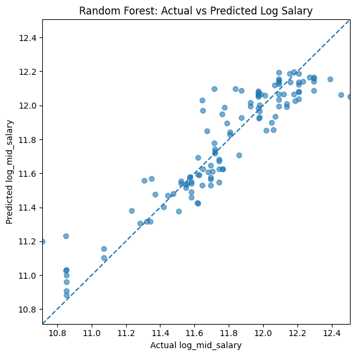
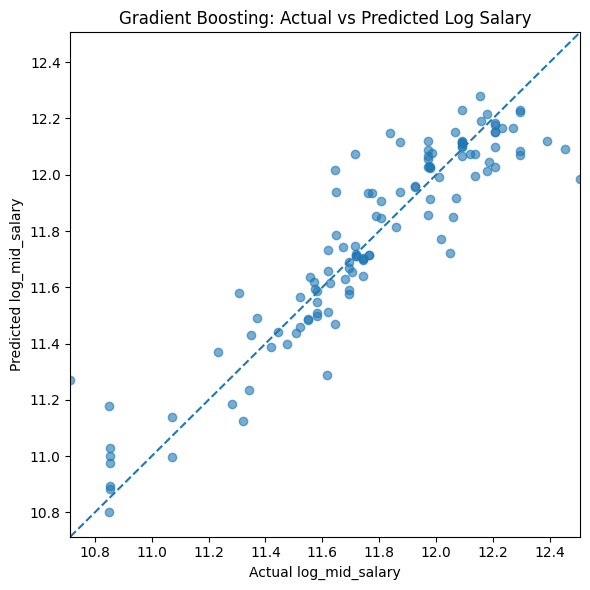
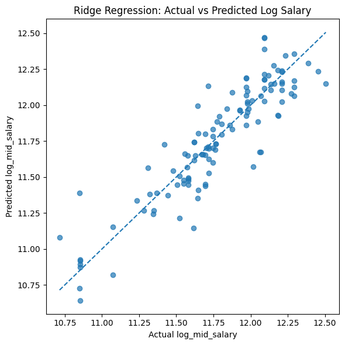
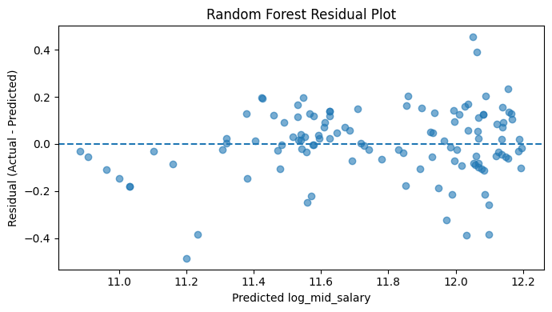
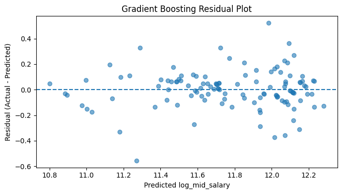
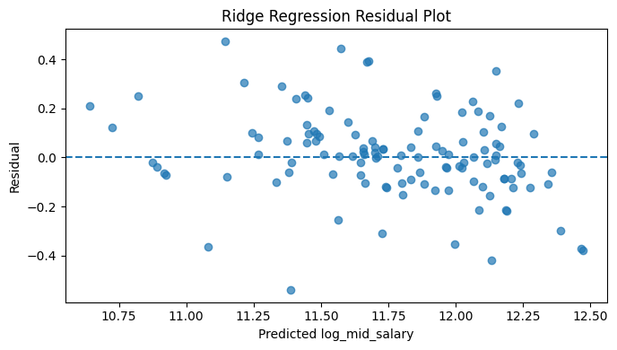
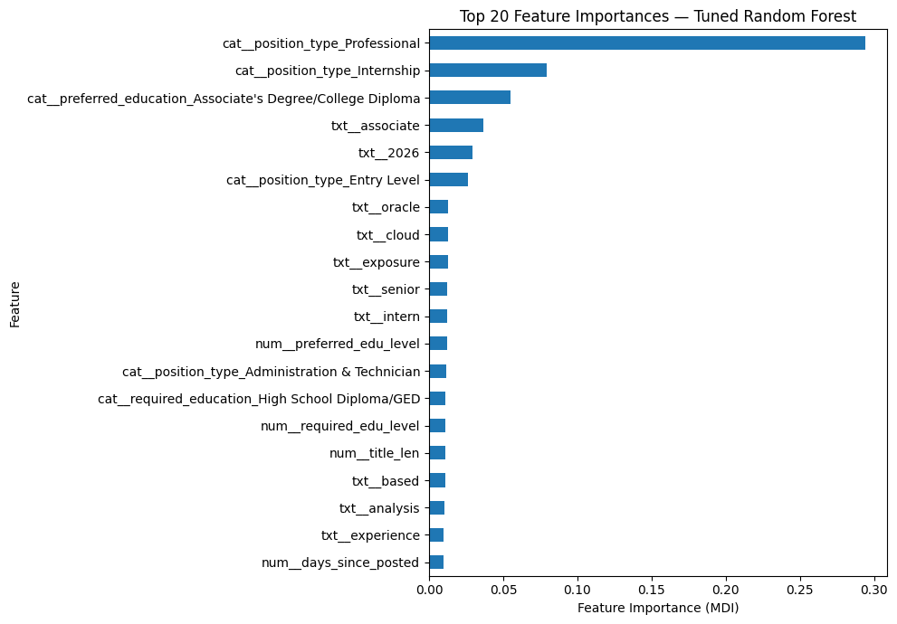

# IBM Job Posting Analysis

Group 16

## 1. Data Acquisition & Preparation

Text

## 2. Exploratory Data Analysis (EDA)

Text

## 3. Feature Engineering & Preprocessing

Text

## 4. Model Development

With our categorical, numerical, and TF-IDF features constructed in the "Feature Engineering" part, we wanted to develop our model for one goal: predict the log midpoint salary based on our features. The features $X$ and targets $y$ were already being defined previously, and we performed a 75/25 train-test split for three models: random forest, gradient boost, and ridge regression.

### 4.1 Three models we chose

- We chose **random forest** because it was an improvement over bagging that selected only a portion of features for each tree, which increased accuracy and robustness against overfitting. For our scenario with hundreds of features, it would be a great method to aggregate the decision trees covering different features, especially when a significant portion of our features are TF-IDF.
- We also chose **gradient boosting** because its sequential error-correction mechanism fundamentally differed from random forest's parallel averaging. Each tree explicitly targeted the residuals of the previous ensemble, which we expected this approach to capture patterns that averaging alone might miss.
- Finally, we chose **ridge regression** as a linear baseline to contrast with the two tree methods. With our prior knowledge of how certain features like job/education level are related, ridge regression would keep these features stable and spread the weight more evenly across.

### 4.2 Parameters for hyperparameter tuning

*Note: the first value listed for each variable was used for baseline.*

**Random Forest:**

| Variable | Why tune this hyperparameter | Options |
|-|-|-|
| Number of Estimators \* | More trees reduce prediction variance and stabilize the ensemble, but with diminishing returns and increasing computation cost. | 200, 500 |
| Portion of All Features | Controls diversity among individual trees by limiting how many features each split considers. Lower values decorrelate trees more, reducing variance at the cost of higher bias per tree. | 0.33, sqrt, 0.2, 0.5 |
| Minimum Samples per Leaf | Acts as regularization by requiring a minimum amount of data at each leaf. Larger values smooth the model and prevent overfitting to noise. | 1, 2, 5 |
| Maximum Depth | Caps tree complexity. Unrestricted depth allows trees to memorize training data; shallower trees generalize better. | None, 20, 40 |

\* Due to computation limits, we could not perform the common practice of starting with 10x number of features.

**Best parameters after tuning:**

| Number of Estimators | 500 |
|-|-|
| Portion of All Features | 0.33 |
| Minimum Samples per Leaf | 1 |
| Maximum Depth | 40 |

---

**Gradient Boost:**

*Note: the first value listed for each variable was used for baseline.*

| Variable | Why tune this hyperparameter | Options |
|-|-|-|
| Number of Estimators \* | More boosting rounds fit the residuals more closely, but too many rounds risk overfitting when the learning rate is not sufficiently small. | 300, 100, 200 |
| Learning Rate | Shrinks each tree's contribution. Smaller values require more estimators but often yield better generalization by taking more conservative steps. | 0.05, 0.03, 0.08 |
| Maximum Depth | Gradient boosting uses shallow trees as weak learners by design. Deeper trees increase each tree's variance, which conflicts with the incremental correction strategy. | 3, 2, 4 |
| Minimum Samples per Leaf | Regularizes individual trees to prevent fitting noise in the residuals. | 1, 3, 5 |
| Subsample | Using a random fraction of samples per tree (stochastic gradient boosting) introduces variance that reduces overfitting and can speed up training. | 1.0, 0.8 |

\* Number of Estimators had been reduced due to high computation demand as shown in Random Forest.

**Best parameters after tuning:**

| Number of Estimators | 300 |
|-|-|
| Learning Rate | 0.05 |
| Maximum Depth | 4 |
| Minimum Samples per Leaf | 1 |
| Subsample | 0.8 |

---

**Ridge Regression:**

The only thing to tune was alpha because ridge regression has a single regularization hyperparameter. Unlike tree-based models, there are no structural choices such as depth or number of estimators — alpha alone controls the strength of the L2 penalty and governs the trade-off between fitting the training data and keeping coefficients small. The list of options we tested on was

$$
[1, 0.01, 0.1, 0.3, 0.5, 0.8, 1.5, 2, 3, 5, 10, 50, 100]
$$

1 was used for our baseline, and the best alpha based on our testing was 0.8.

### 4.3 Performance evaluation method

Our testing metrics included RMSE, MAE, and $R^2$ because they each capture a different aspect of prediction quality on the log-salary scale. RMSE (Root Mean Squared Error) penalizes large errors disproportionately, so it is sensitive to cases where the model badly mispredicts a salary. MAE (Mean Absolute Error) reports the average magnitude of errors and is more robust to outliers, giving a sense of the typical prediction gap. $R^2$ measures the proportion of variance in log salary explained by the model — a value closer to 1 indicates the model captures more of the true variation across job postings.

* To pick out the best performing parameter combination, we first performed cross-validation tests among the training dataset for each combination.
* For random forest and gradient boost, we first tested our baseline and then testing multiple combinations to examine on whether they are sensitive to hyperparameter tuning.
* After finding out the best hyperparameters among available options, we tested them against the testing dataset.
* We also compare the baseline RMSE, tuned CV RMSE, and tuned test RMSE to check whether we experience overfitting from the training dataset.

The following were our results:

**Random Forest:**

| Baseline RMSE (log) | 0.1934 |
|-|-|
| Baseline MAE (log) | 0.1464 |
| Baseline $R^2$ | 0.7196 |
| Tuned CV RMSE (log) | 0.1922 |
| Tuned Test RMSE (log) | 0.1466 |
| Tuned Test MAE (log) | 0.1098 |
| Tuned Test $R^2$ | 0.8568 |

The RMSE hardly changed for training dataset after hyperparameter tuning but decreased sharply for testing dataset. The significant decrease of MAE and increase in $R^2$ shows us that hyperparameter tuning does bring improvement for random forest.

---

**Gradient Boosting:**

| Baseline RMSE (log) | 0.1812 |
|-|-|
| Baseline MAE (log) | 0.1392 |
| Baseline $R^2$ | 0.7545 |
| Tuned CV RMSE (log) | 0.1816 |
| Tuned Test RMSE (log) | 0.1496 |
| Tuned Test MAE (log) | 0.1077 |
| Tuned Test $R^2$ | 0.8508 |

Gradient boosting delivered similar results to random forest, with a slightly better baseline performance, meaning that the improvement was actually smaller. In other words, it has been less sensitive to hyperparameter tuning and we may expect less improvements in another case.

---

**Ridge Regression:**

| Baseline RMSE (log) | 0.1916 |
|-|-|
| Baseline MAE (log) | 0.1454 |
| Baseline $R^2$ | 0.7249 |
| Tuned CV RMSE (log) | 0.1865 |
| Tuned Test RMSE (log) | 0.1753 |
| Tuned Test MAE (log) | 0.1286 |
| Tuned Test $R^2$ | 0.7953 |

Ridge regression showed worse improvement compared to the two tree methods, likely because it is a linear model that cannot capture non-linear relationships between features and log salary. Even with L2 regularization, ridge regression fits a hyperplane through the feature space and cannot model the complex interactions present in this dataset — particularly among the hundreds of TF-IDF features, which require non-linear decision boundaries to contribute meaningfully to salary prediction.

## 5. Model Comparison & Selection

### 5.1 Model performance comparison by error

The following is the comparison of tuned test RMSE in dollar value for each method:

| Random Forest | Gradient Boosting | Ridge Regression |
|-|-|-|
| 21,727 | 22,270 | 25,541 |

And the following is the comparison of tuned test MAE in dollar value for each method:

| Random Forest | Gradient Boosting | Ridge Regression |
|-|-|-|
| 15,310 | 14,929 | 17,818 |

Despite the closeness of random forest and gradient boosting, a difference of $1,000 can still be significant in this context. Due to computational limits, we only tested 20 combinations of each tree method's hyperparameter settings. Based on the results, we believe random forest has more potential if parameters could be further improved, given how much it already improved over the baseline and its strong performance on the test dataset.

Moreover, the poor performance of ridge regression showed us how penalty and improvement from past training would do little to training, another reason to choose an aggregation of diversified decision tree like random forest.

### 5.2 Model performance comparison by plot

**Actual vs. Predicted**

| | | |
|-|-|-|
|   |  |  |

**Residual Plot**

| | | |
|-|-|-|
|  |  |  |

Visually, all three reflected similar performances across the testing dataset, with ridge regression having relatively larger errors than the other two methods. Random forest appear to have more clustering on the plot compared to the other two with broad distribution, which shows that random forest tends to have less variance compared to the other two.

**Top 20 Features (Tree Only)**

| | |
|-|-|
|  |  |

While both models' result proved our hypothesis that critical factors including job level and education level would affect the salary, random forest shows a much better distribution across these features. The feature importances are calculated using Mean Decrease Impurity (MDI): the higher the value, the purer the descendent data after this decision node. Random forest's random feature selection feature provides a more balanced distribution across features, making the top feature "Professional" having only 0.2939 MDI. On the other hand, continuous learning for gradient boosting led to high importance of "Professional" with 0.4867 MDI. As a result, random forest makes features much balanced especially when we have hundreds of features.

## 6. Conclusion & Discussion

Text

## 7. Group member contributions

* Zhonghao Liu took charge of the random forest building and testing. After all three models were done by the team, Liu took over the entire model section by unifying the testing approach and recorded the data. Liu was also responsible for part 4 & 5 for this report and the model part of the dashboard.l

## 8. Acknowledgements

The data in this report for supervised learning models is different from the earlier presentation. After the presentation, we unified the testing methods for all three methods for better comparison. Unfortunately, the alternative approach led to excessively long running time for random forest and gradient boosting, and therefore we cannot replicate our presentation test results. To resolve this, the TF-IDF features had been reduced from 1000 to 100, and only 20 randomly selected parameter combinations were chosen for these two methods, leading to slightly different results.
