# IBM Job Posting Analysis

Group 16: Baixuan Chen, Zhonghao Liu, Jisheng Zeng, Daisy Zhou

## Introduction
This project documents an end-to-end data science pipeline for predicting salaries from publicly available job postings at IBM. The main research question that we aim to solve with this dataset is: Based on the IBM job posting data, how accurately can we predict salary, and which features are the primary drivers for this prediction? 

Salary transparency has become increasingly important as pay disclosure laws expand across the United States. However, posted salary ranges are often broad and influenced by different factors such as job family, seniority, geographic location, education requirements, and specific technical skills listed in the job description. As a result, it is important to understand how these factors altogether determine compensation, and a predictive model trained on real job posting can serve as both a benchmarking tool and as a way to generate meaningful insights into how a major technology employer structures compensation across its different roles.

To translate this objective into a practical solution, we implement a structured data science pipeline that encompasses data preparation, exploratory analysis, feature engineering, and predictive modeling. 

This report follows the standard workflow: 

- **Data Acquisition and Preparation**: Type conversion, formatting normalization, duplicate removal, missing value handling on the raw scraped data
- **Exploratory Data Analysis**: Data quality checks, univariate distributions, bivariate and multivariate analysis (including statistical tests), time trends, skill keyword frequency, outlier checks
- **Data Preprocessing**: Final dataset selection, missing value strategy, rare category pooling, encoding for categorical variables, numerical scaling
- **Feature Engineering**: Engineering salary variables, date features, location features, ordinal education encoding, job title parsing for seniority signals, skill flags
- **Unsupervised Learning**: Correlation analysis, PCA for dimensionality reduction, K-means clustering, additional outlier detection
- **Supervised Learning**: Random Forest, Ridge Regression, and Gradient Boosting modeling with cross-validation, hyperparameter tuning, and evaluation against held-out test data
- **Model Comparison and Selection**: Quantitative comparison RMSE, MAE, and R^2 metrics with qualitative considerations (interpretability, robustness) to select a final model

## 1. Data Acquisition & Preparation

The dataset was acquired by scraping IBM’s public careers website and was filtered to job postings located in the United States. Because the careers site renders job listings dynamically through JavaScript rather than as a static HTML, a request-based scraper such as BeautifulSoup would not have been sufficient, so we used Selenium to extract its content. All of the code used for acquiring the data is found in ibm_scraping.ipynb. The raw scraped dataset `ibm_jobs_raw.csv` contains 478 rows and 11 columns, with each row representing a single job posting and columns covering structural metadata (i.e. job ID, job title, posting date, state/province), role attributes (area of work, position type), educational requirements (required and preferred), unstructured textual descriptions of preferred technical experience, and posted salary endpoints (min and max salary). Here, salary is the primary outcome of interest. 

**Table 1:** Data Dictionary 
| Column | Description |
|---|---|
| `job_title` | Job title as posted (e.g., "Senior Software Engineer") |
| `job_id` | Unique IBM-assigned posting identifier |
| `date_posted` | Posting date in `DD-MMM-YYYY` format |
| `state_province` | State(s) where the role is based; may contain multiple comma-separated states |
| `area_of_work` | Business area (e.g., Software Engineering, Consulting, Sales) |
| `min_salary` | Projected minimum annual salary (USD) |
| `max_salary` | Projected maximum annual salary (USD) |
| `position_type` | Role level: Professional, Entry Level, Internship, or Administration & Technician |
| `required_education` | Minimum required education (e.g., Bachelor's Degree) |
| `preferred_education` | Preferred education level (often missing) |
| `preferred_technical_experience` | Free-text description of preferred technical skills (often missing) |

To prepare the raw dataset for downstream analysis, inconsistencies were first addressed. Salary fields were stored as strings with embedded commas, so they were stripped of formatting characters and cast to numeric `min_salary_num` and `max_salary_num` columns. Posting dates, which appear in a “30-Jan-2026” string format, were parsed into a `date_posted_dt` datetime column. Education values were normalized for casing and whitespace to consolidate near-duplicates, and all string fields were trimmed of leading and trailing whitespace. Additionally, two derived numeric features were created: `mid_salary` and `salary_range`. The former represents the midpoint of the posted salary band using the `min_salary_num` and `max_salary_num` columns, while the latter is the spread between the minimum and maximum. 

Salary validity checks also revealed no logical inconsistencies. There were 0 cases where `min_salary_num` exceeded `max_salary_num`, and there were no non-positive salaries either. On the de-duplicated data, `min_salary_num` had a minimum of 29,120 and a mean of 105,427, while `max_salary_num` reached up to 410,000. `mid_salary` had a median of 134,000 and a mean of 141,138. 

Furthermore, duplicate value detection revealed seven exact duplicate `job_id` values which were likely a byproduct of the web scraping process recapturing the same job posting. We removed these duplicate values on `job_id` to produce a final dataset of 471 unique postings.

To initially handle any missing values, any observations missing `min_salary`, `max_salary`, and `job_title` were dropped since a posting’s outcome variable cannot be defined without salary. We also discovered that missingness was concentrated in a small number of columns with `preferred_education` missing in 123 out of 478 rows (25.73%) and with `preferred_technical_experience` missing in 92 out of the 478 rows (19.25%).  Any NaN values in `preferred_technical_experience` were filled with an empty string, while any NaN values in `area_of_work` were replaced with the string “unknown”.  

  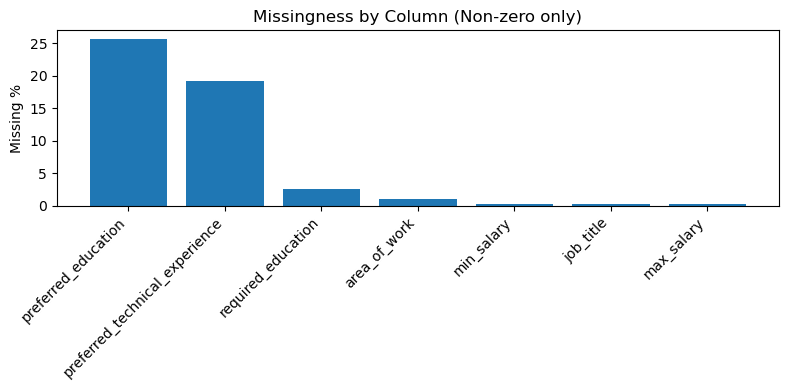 
  <em>Figure 1: Missing value counts by column</em>

After initial data cleaning and preparation, the analysis-ready dataset spans a posting window from August 14, 2025 to February 4, 2026 with `min_salary_num` ranging from $29,120 to $275,000 and `max_salary_num` reaching up to $410,000. The median `mid_salary` is approximately $137,000. 

## 2. Exploratory Data Analysis (EDA)

The EDA is structured around four deeper questions:
What does the data look like in terms of quality and structure?
How do individual variables distribute?
How does salary relate to different job attributes?
How do these patterns shift over time?

The objective of this section is to both characterize the dataset and to identify key relationships that should inform the decisions we make for feature engineering and supervised modeling later down the pipeline. All subsequent analyses have been performed on the de-duplicated dataset of 471 unique job postings. 

### Univariate Distributions

The categorical composition of the postings is dominated by professional level roles. As seen in Figure 2, Position type is heavily skewed toward Professional (271 postings, 57.5%) with Internship (100, 21.2%) and Entry Level (90, 19.1%) positions representing smaller shares (Figure 2) . Administration and Technician roles are the rarest with only 10 postings (2.1%). Area of work has a longer tail with the largest categories being Software Engineering, Consulting, and Sales followed by Infrastructure & Technology, Design & UX, and Product Management (Figure 3). The remaining postings are distributed across smaller business areas. 

  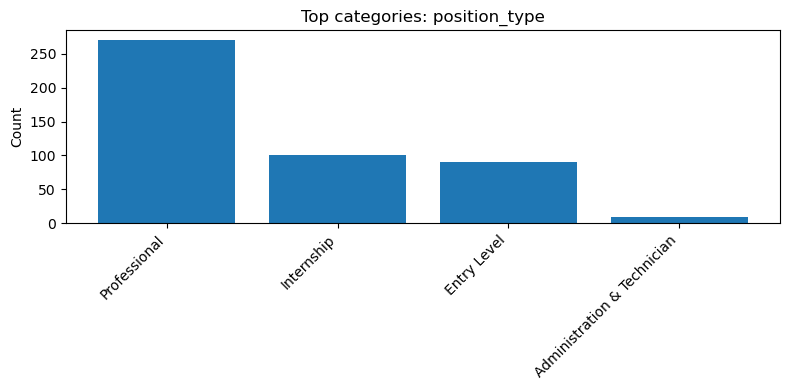 
  <em>Figure 2: Total Count by Position Type</em>

  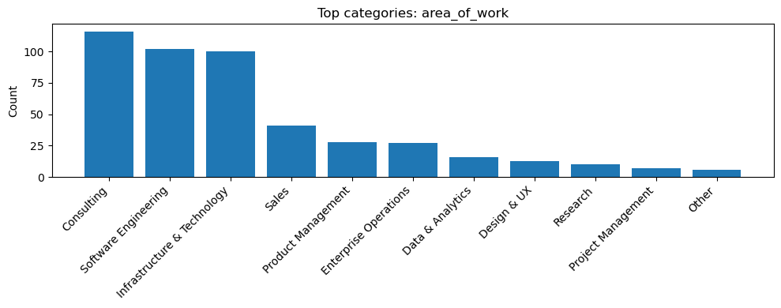 
  <em>Figure 3: Total Count by Area of Work</em>

Education requirements are bimodal where required education clusters around High School Diploma/GED and Bachelor’s Degree and much smaller representation at the Master’s and Doctorate level. Additionally, the `state_province` field is not a clean single-state variable with about 62% of postings listing multiple comma-separated states in a single string. This suggests that these job postings may represent flexible, multi-region, or even remote-eligible recruiting rather than a single fixed location. This has implications for feature engineering, where the `state_province` field cannot be one-hot encoded directly and will instead need to be parsed into derived signals such as a count of states listed and a multi-state indicator. 

  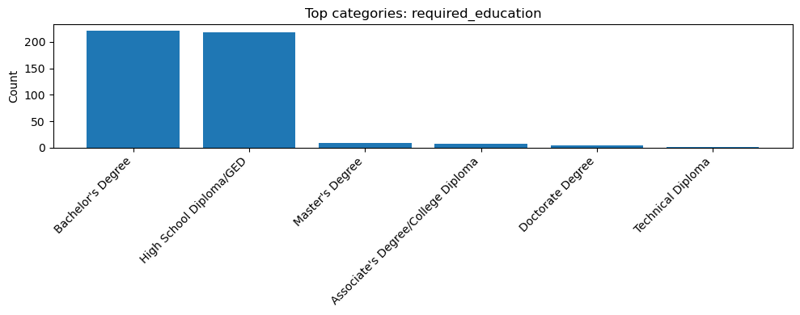 
  <em>Figure 4: Total Count by Required Education</em>

Salary itself is right-skewed as shown in Figure 5. The distribution of `mid_salary` has a long right tail driven by a small number of jobs with extremely high salaries which are tied to senior professional roles. The median sits at around $137,000 with salary levels extending past $300,000. This also has implications for feature engineering where a transformation is required to produce a much more symmetric distribution. Furthermore, as seen in Figure 6, `salary_range` (salary maximum - salary minimum) is also right-skewed with a majority of job postings spanning $50,000 to $90,000 of band width and a median sitting at around $70,000. It can also be seen that only 2 job postings have a fixed salary point where the range is 0. 

  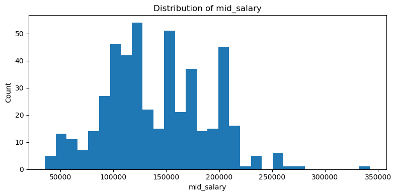 
  <em>Figure 5: Distribution of mid_salary</em>

  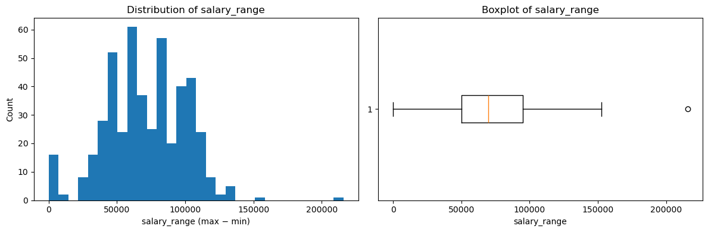 
  <em>Figure 6: Distribution of salary_range</em>

### Bivariate Relationships and Statistical Tests

Salary differs significantly across all three of the main job-attribute variables: area of work, position type, and required education. However, the magnitude of the gap differs across them. 

Across the top 8 areas of work, it can be seen that Consulting and Software Engineering sit at the high end with median `mid_salary` of approximately $157,000 and $154,000, respectively (Figure 7). Infrastructure & Technology on the other hand shows a noticeably lower median than the other groups. Because the salary distribution is visibly right skewed and variance fluctuates across the different groups, we conducted a Kruskal-Wallis test where the resulting H and p-values were 67.25 and 5.30e-12 respectively. A small p-value suggests that there is very strong evidence that the differences in `mid_salary` across business areas reflect a real pattern in IBM’s compensation rather than random sampling variation. 

  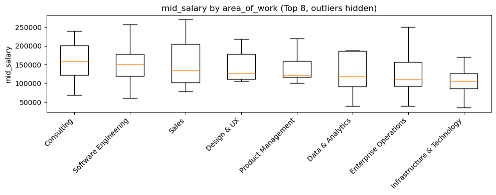 
  <em>Figure 7: mid_salary Distribution by area_of_work</em>

Across position types, the difference in salary levels is noticeably greater (Figure 8). Professional roles have a median of around $173,000, while Entry level positions have a median of around $113,000. Conducting another Kruskal-Wallis test shows that H is approximately 295.37 and p is approximately 9.99e-64 which suggests that position type is an important driver of compensation in this dataset. 

  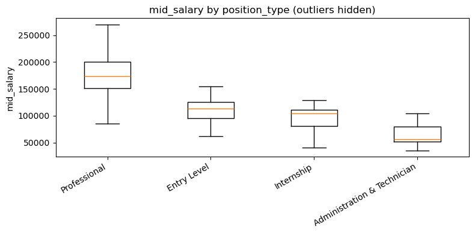 
  <em>Figure 8: mid_salary Distribution by position_type</em>

Across required education, there is a clear ordinal pattern with High School Diploma/GED postings having a median around $112,000, Bachelor’s around $158,000, and Master’s around $196,500 (Figure 9). The Doctorate group has the highest median but with very few postings, and the Kruksal-Wallis test is again significant. Because education is naturally ordered, this finding motivates the need for encoding required education and preferred education as ordinal levels in feature engineering rather than one-hot dummy variables. 

  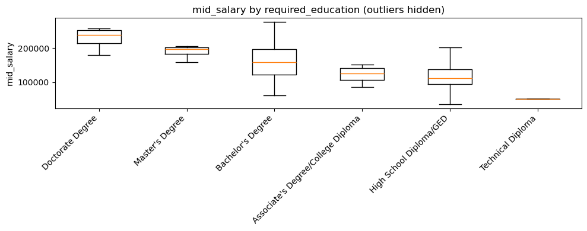 
  <em>Figure 9: mid_salary Distribution by required_education</em>

In addition, we analyze the relationship between `mid_salary` and `salary_range` as shown in Figure 10 which results in a strong positive Pearson correlation (r = 0.81). This means that higher paying job postings also have wider posted bands and aligns with the idea that senior roles allow more compensation flexibility and negotiation. 

  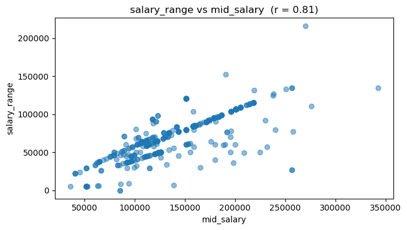 
  <em>Figure 10: salary_range vs mid_salary </em>

Finally, area of work and position type are not independent of each other (Figure 11). We conduct a Chi-Square test with $\chi^2$ = 112.78, dof = 21, p = 1.48e-14 which rejects independence and a Cramer’s V statistic of 0.29 indicates a moderate association. Certain areas such as Consulting are disproportionately professional, while others contain more entry-level and internship positions. This means that salary gaps between business areas come from two sources: real differences in pay across areas, and some areas hire more senior individuals than others. This is an important finding that would be accommodated in the modeling stage. 

  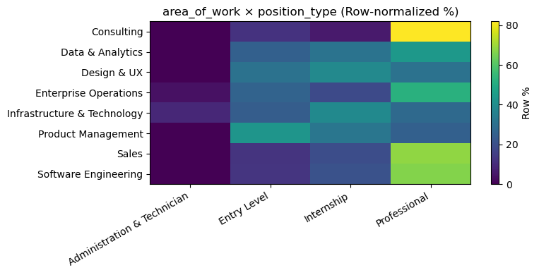 
  <em>Figure 11: Heat Map of area_of_work x position_type</em>

### Skill Keyword Analysis
The unstructured `preferred_technical_experience` field was tokenized using a curated vocabulary of single-world and multi-word skill terms, and phrases like “machine learning” matched before single tokens to avoid double counting. As shown in Figure 12, among the 470 postings with a valid `mid_salary`, AI-related keywords lead with “ai” appearing in 14.3% of postings followed by “agile” (10.6%), “python” (9.1%), and “aws” (7.4%). The prominence of AI keywords is consistent with IBM’s recent strategic emphasis on generative AI, and the broader top-10 keywords reflect a focus on and need for cloud and data engineering skills. 

  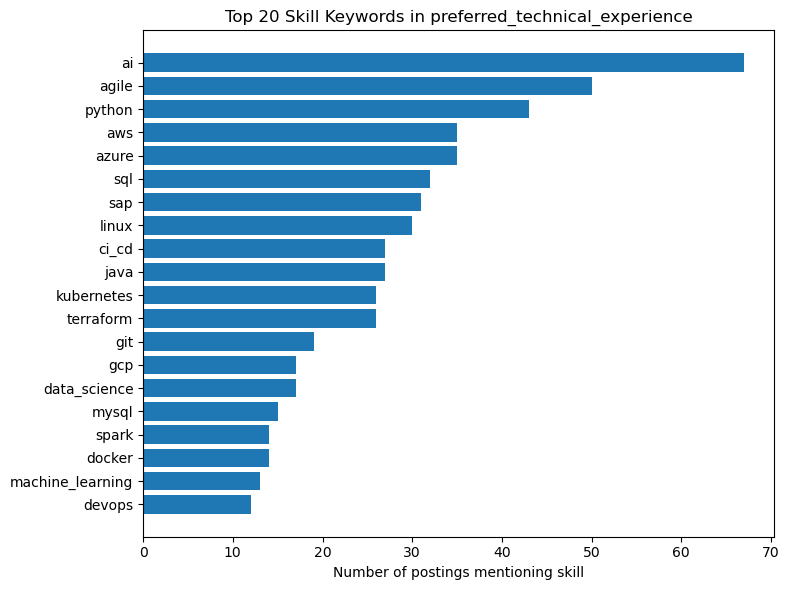 
  <em>Figure 12: Top 20 Skill Keywords in Preferred Technical Experience</em>

A comparison of median salary “with skill mentioned” vs. “without skill mentioned” shows that 9 of the top 10 skills have a negative median salary difference (Figure 13). For example, the gap for Linux and Python exceeds $30,000. This reveals possible confounding-by-missingness rather than a result of true skill devaluation. As seen in the data quality section, approximately 19% of postings have `preferred_technical_experience` missing, and this missing count is concentrated in higher paying non-technical roles. More specifically, approximately 30% are missing in Consulting, 24% in Sales, and 24% among Professional-level postings. The “without skill” reference group is therefore heavily weighted toward senior, high-paid, non-technical postings which inflates the baseline. SAP is seen as an exception because it is the one skill in the top 10 concentrated in those higher paid Consulting roles. 27 of 31 SAP postings are in Consulting, and 26 of these 31 are also at the Professional level, dominated by Senior Management Consultant titles. This is an important finding for modeling: skill-salary marginals from this raw text field reflect role composition more than skill value. Therefore, skills should be brought into the model as binary indicator features which can be seen later in Section 6.7 of the jupyter notebook. 

  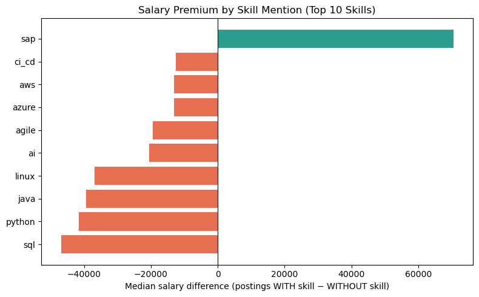 
  <em>Figure 13: Median Salary Difference by Top 10 Skill Mentions</em>

### Time Trends and Outlier Checks 

Posting volume is heavily concentrated near the end of the observation window, with January 2026 alone accounting for 261 of the 469 postings (55%) and the earlier months are substantially sparser. The weekly view in Figure 14 confirms a sharp increase in job postings. Counts climbed from 27 in the week of January 5, 2026 to 58, 61, and 115 in successive weeks, peaking at the end of February. It is important to note however that the current data listed on the IBM website is not the same as the data we used for the project which was scraped from the website at an earlier time. This implies that older postings tend to be filled and removed before the web scrape runs. Therefore, monthly time trends should be interpreted as short-run level shifts rather than long-run trends.

  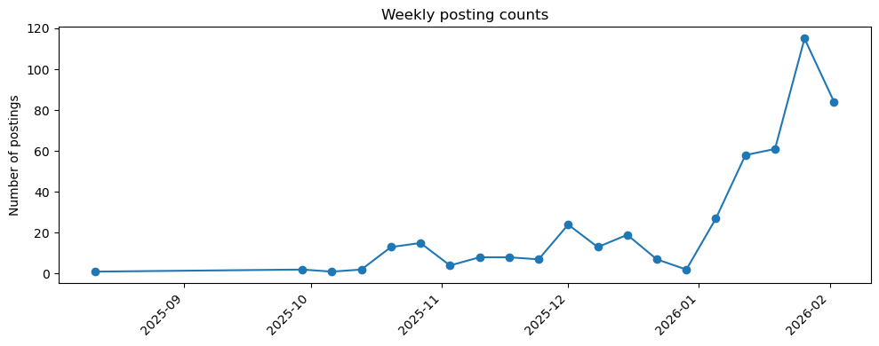 
  <em>Figure 14: Weekly Posting Counts</em>

The monthly median `mid_salary` follows a similar trajectory where compensation levels hover at around $107,000 in November 2025 before rising to $120,000 in December 2025 and then $155,750 in January 2026 (Figure 15). Salary then drops to $141,000 in February. Because position type is the dominant salary driver and Professional-level postings spike the most during this same January surge (Figure 16), the apparent salary uptrend is likely a compositional effect. January specifically attracts a heavier mix of professional roles and is when companies typically resume their hiring after the holidays. 

  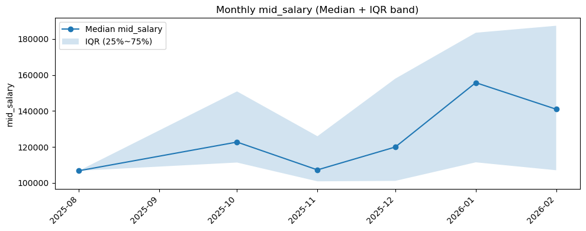 
  <em>Figure 15: Monthly mid_salary Levels</em>

  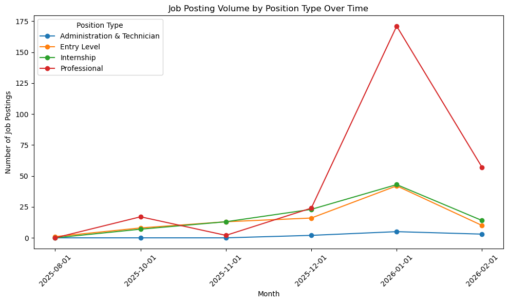 
  <em>Figure 16: Job Posting Volume by Position Type Over Time</em>

Outlier detection on `mid_salary` using the standard 1.5 IQR rule flags a small number of high end postings with `max_salary_num` reaching $410,000. Manual inspection of the top 10 highest paid job postings confirmed they are primarily senior Consulting and Engineering roles, so they were retained in the dataset. It is also important to note that throughout our EDA, we report medians and quantiles to preserve robustness rather than means. 

**Table 2:** Top 10 highest `mid_salary` postings

| job_id | job_title | date_posted | state_province | area_of_work | position_type | min_salary_num | max_salary_num | mid_salary | salary_range |
|---|---|---|---|---|---|---|---|---|---|
| 89533 | Principal Engineer, Db2 for z/OS | 04-Feb-2026 | California | Software Engineering | Professional | 275,000 | 410,000 | 342,500 | 135,000 |
| 80088 | Software Engineer - Streaming | 03-Feb-2026 | Texas, Massachusetts, California | Software Engineering | Professional | 220,800 | 331,200 | 276,000 | 110,400 |
| 86223 | Ecosystem Technical Strategist | 23-Jan-2026 | Texas, New York, California | Sales | Professional | 162,000 | 378,000 | 270,000 | 216,000 |
| 90520 | Senior Quantum Error Correction Theorist | 03-Feb-2026 | New York | Research | Professional | 219,000 | 296,000 | 257,500 | 77,000 |
| 87906 | Staff Software Engineer - HashiCorp Secure Run... | 27-Jan-2026 | Texas, Massachusetts, California | Software Engineering | Professional | 189,000 | 324,000 | 256,500 | 135,000 |
| 72905 | Senior Digital Asset Sales | 03-Feb-2026 | New York | Sales | Professional | 243,000 | 270,000 | 256,500 | 27,000 |
| 83085 | Staff Engineer - Full Stack - HCP Terraform Founda... | 05-Jan-2026 | Texas, North Carolina, Massachusetts, California | Software Engineering | Professional | 189,000 | 324,000 | 256,500 | 135,000 |
| 72906 | Senior Digital Asset Tech Sales | 20-Jan-2026 | New York | Sales | Professional | 243,000 | 270,000 | 256,500 | 27,000 |
| 81989 | U.S. Public Sector Compliance Officer | 20-Dec-2025 | Texas, New York, Virginia, Alabama, Colorado, ... | Enterprise Operations | Professional | 184,000 | 317,000 | 250,500 | 133,000 |
| 85759 | Industry Quantum Consultant | 12-Jan-2026 | New York | Consulting | Professional | 200,000 | 280,000 | 240,000 | 80,000 |

Lastly, a final missingness check showed that the missingness rates of `preferred_education` and `preferred_technical_experience` vary across both position type (Figure 17, 18) and area of work (Figure 19). This reinforces an earlier discovery that missingness in these fields is indeed informative and should be treated as “no requirement” for these specific fields. 

  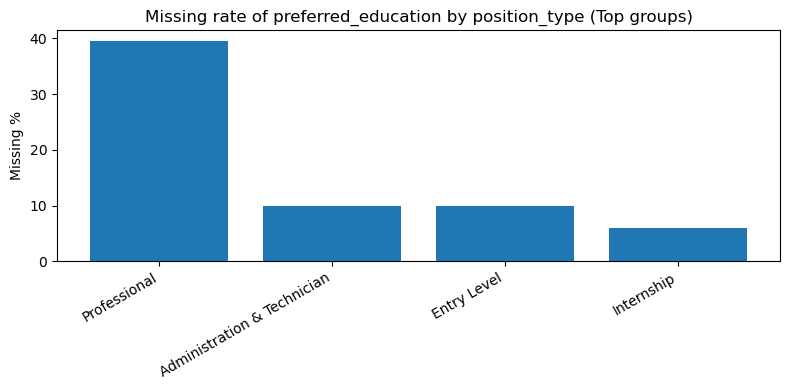 
  <em>Figure 17: Missing Rate of preferred_education by position_type</em>

  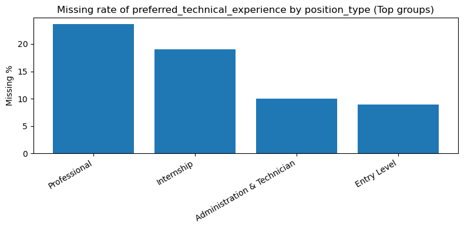 
  <em>Figure 18: Missing Rate of preferred_technical_experience by position_type</em>

  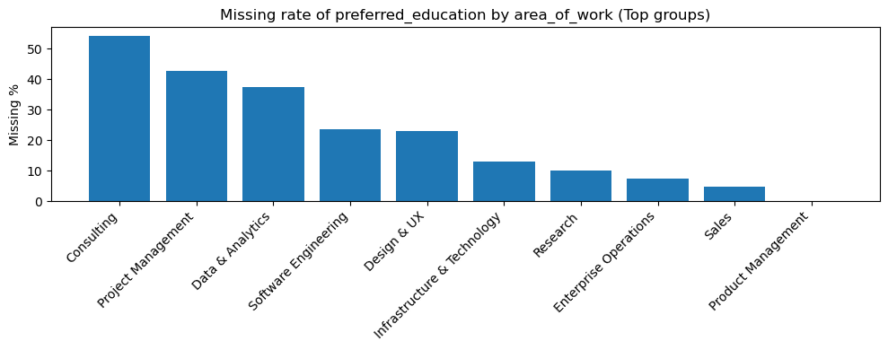 
  <em>Figure 19: Missing Rate of preferred_technical_experience by area_of_work</em>

### EDA Summary 
Overall, the Exploratory Data Analysis establishes three key findings that drive the remainder of our project. First, position type is the dominant driver of salary, followed by area of work and required education. These dimensions themselves are correlated with each other, which we will dive deeper into in Feature Engineering. Second, salary is right-skewed and benefits from a log transformation for modeling. Third, missingness in the preferred experience and preferred education fields is non-random and concentrated in high paying segments which informs downstream feature engineering decisions.

## 3. Feature Engineering & Preprocessing

Text

## 4. Model Development

With our categorical, numerical, and TF-IDF features constructed in the "Feature Engineering" part, we wanted to develop our model for one goal: predict the log midpoint salary based on our features. The features $X$ and targets $y$ were already being defined previously, and we performed a 75/25 train-test split for three models: random forest, gradient boost, and ridge regression.

### 4.1 Three models we chose

- We chose **random forest** because it was an improvement over bagging that selected only a portion of features for each tree, which increased accuracy and robustness against overfitting. For our scenario with hundreds of features, it would be a great method to aggregate the decision trees covering different features, especially when a significant portion of our features are TF-IDF.
- We also chose **gradient boosting** because its sequential error-correction mechanism fundamentally differed from random forest's parallel averaging. Each tree explicitly targeted the residuals of the previous ensemble, which we expected this approach to capture patterns that averaging alone might miss.
- Finally, we chose **ridge regression** as a linear baseline to contrast with the two tree methods. With our prior knowledge of how certain features like job/education level are related, ridge regression would keep these features stable and spread the weight more evenly across.

### 4.2 Parameters for hyperparameter tuning

*Note: the first value listed for each variable was used for baseline.*

**Random Forest:**

| Variable | Why tune this hyperparameter | Options |
|-|-|-|
| Number of Estimators \* | More trees reduce prediction variance and stabilize the error rate, but an overly large number of trees would lead to high computation cost for little improvement. | 200, 500 |
| Portion of All Features | Controls diversity among individual trees by limiting how many features each split considers. Lower values would lower the correlation between trees and therefore improving robustness against overfitting. | 0.33, sqrt, 0.2, 0.5 |
| Minimum Samples per Leaf | Acts as regularization by requiring a minimum amount of data at each leaf. A higher value would lead to more general leaf nodes that could prevent overfitting. | 1, 2, 5 |
| Maximum Depth | Deeper trees capture more detailed patterns, but an overly deep tree would lead to overfitting and less generalization. | None, 20, 40 |

\* Due to computation limits, we could not perform the common practice of starting with 10x number of features.

**Best parameters after tuning:**

| Feature | Value |
|-|-|
| Number of Estimators | 500 |
| Portion of All Features | 0.33 |
| Minimum Samples per Leaf | 1 |
| Maximum Depth | 40 |

---

**Gradient Boost:**

*Note: the first value listed for each variable was used for baseline.*

| Variable | Why tune this hyperparameter | Options |
|-|-|-|
| Number of Estimators \* | More trees reduce prediction variance and stabilize the error rate, but an overly large number of trees would lead to high computation cost for little improvement. | 300, 100, 200 |
| Learning Rate | Determines how much a tree would contribute to final result. A smaller value would lead to stronger results but also requires more estimators. | 0.05, 0.03, 0.08 |
| Maximum Depth | Deeper trees capture more detailed patterns, but an overly deep tree would lead to overfitting and less generalization. | 3, 2, 4 |
| Minimum Samples per Leaf | Acts as regularization by requiring a minimum amount of data at each leaf. A higher value would lead to more general leaf nodes that could prevent overfitting. | 1, 3, 5 |
| Subsample | Using a random fraction of samples per tree would speed up the training process and reduce overfitting. | 1.0, 0.8 |

\* Number of Estimators had been reduced due to high computation demand as shown in Random Forest.

**Best parameters after tuning:**

| Feature | Value |
|-|-|
| Number of Estimators | 300 |
| Learning Rate | 0.05 |
| Maximum Depth | 4 |
| Minimum Samples per Leaf | 1 |
| Subsample | 0.8 |

---

**Ridge Regression:**

The only thing to tune was alpha because ridge regression has a single regularization hyperparameter. Unlike tree-based models, we let alpha alone to control the regularization strength, where a larger value would lead to more significant shrinking in coefficients. The list of options we tested on was

$$
[1, 0.01, 0.1, 0.3, 0.5, 0.8, 1.5, 2, 3, 5, 10, 50, 100]
$$

1 was used for our baseline, and the best alpha based on our testing was 0.8.

### 4.3 Performance evaluation method

Our testing metrics included RMSE, MAE, and $R^2$ because they each capture a different aspect of prediction quality.
* RMSE (Root Mean Squared Error) penalizes large errors disproportionately, so it is sensitive to cases where the model badly mispredicts a salary.
* MAE (Mean Absolute Error) reports the average magnitude of errors and is more robust to outliers.
* $R^2$ measures the proportion of variance: a value closer to 1 indicates the model captures more of the true variation across job postings.

How we picked out the best performing parameter combination:
* We first performed cross-validation tests among the training dataset for each combination.
* For random forest and gradient boost, we first tested our baseline and then testing multiple combinations to examine on whether they are sensitive to hyperparameter tuning.
* After finding out the best hyperparameters among available options, we tested them against the testing dataset.
* We also compare the baseline RMSE, tuned CV RMSE, and tuned test RMSE to check whether we experience overfitting from the training dataset.

The following were our results:

**Random Forest:**

| Criteria | Value |
|-|-|
| Baseline RMSE (log) | 0.1934 |
| Baseline MAE (log) | 0.1464 |
| Baseline $R^2$ | 0.7196 |
| Tuned CV RMSE (log) | 0.1922 |
| Tuned Test RMSE (log) | 0.1466 |
| Tuned Test MAE (log) | 0.1098 |
| Tuned Test $R^2$ | 0.8568 |

The RMSE hardly changed for training dataset after hyperparameter tuning but decreased sharply for testing dataset. The significant decrease of MAE and increase in $R^2$ shows us that hyperparameter tuning does bring improvement for random forest.

---

**Gradient Boosting:**

| Criteria | Value |
|-|-|
| Baseline RMSE (log) | 0.1812 |
| Baseline MAE (log) | 0.1392 |
| Baseline $R^2$ | 0.7545 |
| Tuned CV RMSE (log) | 0.1816 |
| Tuned Test RMSE (log) | 0.1496 |
| Tuned Test MAE (log) | 0.1077 |
| Tuned Test $R^2$ | 0.8508 |

Gradient boosting delivered similar results to random forest, with a slightly better baseline performance, meaning that the improvement was actually smaller. In other words, it has been less sensitive to hyperparameter tuning and we may expect less improvements in another case.

---

**Ridge Regression:**

| Criteria | Value |
|-|-|
| Baseline RMSE (log) | 0.1916 |
| Baseline MAE (log) | 0.1454 |
| Baseline $R^2$ | 0.7249 |
| Tuned CV RMSE (log) | 0.1865 |
| Tuned Test RMSE (log) | 0.1753 |
| Tuned Test MAE (log) | 0.1286 |
| Tuned Test $R^2$ | 0.7953 |

Ridge regression showed worse improvement compared to the two tree methods, likely because it is a linear model that cannot capture non-linear relationships between features and log salary. It performed particularly bad among the hundreds of TF-IDF features, which require non-linear decision boundaries to contribute meaningfully to salary prediction.

## 5. Model Comparison & Selection

### 5.1 Model performance comparison by error

The following is the comparison of tuned test RMSE in dollar value for each method:

| Random Forest | Gradient Boosting | Ridge Regression |
|-|-|-|
| 21,727 | 22,270 | 25,541 |

And the following is the comparison of tuned test MAE in dollar value for each method:

| Random Forest | Gradient Boosting | Ridge Regression |
|-|-|-|
| 15,310 | 14,929 | 17,818 |

Despite the closeness of random forest and gradient boosting, a difference of $1,000 can still be significant in this context. Due to computational limits, we only tested 20 combinations of each tree method's hyperparameter settings. Based on the results, we believe random forest has more potential if parameters could be further improved, given how much it already improved over the baseline and its strong performance on the test dataset.

Moreover, the poor performance of ridge regression showed us how penalty and improvement from past training would do little to training, another reason to choose an aggregation of diversified decision tree like random forest.

### 5.2 Model performance comparison by plot

**Actual vs. Predicted**

| | | |
|-|-|-|
|   |  |  |

**Residual Plot**

| | | |
|-|-|-|
|  |  |  |

Visually, all three reflected similar performances across the testing dataset, with ridge regression having relatively larger errors than the other two methods. Random forest appear to have more clustering on the plot compared to the other two with broad distribution, which shows that random forest tends to have less variance compared to the other two.

**Top 20 Features (Tree Only)**

| | |
|-|-|
|  |  |

While both models' result proved our hypothesis that critical factors including job level and education level would affect the salary, random forest shows a much better distribution across these features. The feature importances are calculated using Mean Decrease Impurity (MDI): the higher the value, the purer the descendent data after this decision node. Random forest's random feature selection feature provides a more balanced distribution across features, making the top feature "Professional" having only 0.2939 MDI. On the other hand, continuous learning for gradient boosting led to high importance of "Professional" with 0.4867 MDI. As a result, random forest makes features much balanced especially when we have hundreds of features.

## 6. Conclusion & Discussion

This project developed a full end-to-end data science pipeline to predict job salaries using IBM job posting data. Across the workflow, we combined data cleaning, exploratory data analysis, feature engineering, unsupervised learning, and supervised modeling to build and evaluate predictive models.

From the modeling results, tree-based methods significantly outperformed the linear baseline. Ridge regression, while interpretable, was limited by its inability to capture nonlinear relationships among features, especially in the presence of high-dimensional TF-IDF variables. In contrast, both Random Forest and Gradient Boosting demonstrated strong predictive performance, confirming that salary is driven by complex interactions between job characteristics.

Although Gradient Boosting achieved the best overall predictive accuracy, Random Forest was selected as the final model. This decision reflects a trade-off between performance, interpretability, and robustness. The performance gain from Gradient Boosting was relatively small, while Random Forest provides more stable predictions, is less sensitive to hyperparameter tuning, and offers clearer feature importance interpretation. These properties make it more suitable for real-world applications.

Beyond predictive performance, the analysis also provided meaningful insights into salary drivers. Position type emerged as the most influential factor, followed by area of work and education level. Additionally, the strong positive relationship between salary level and salary range suggests that higher-level roles offer greater compensation flexibility. These findings align with expectations of labor market structure within large technology firms.

Despite these strengths, the project has several limitations. First, the dataset is relatively small, with fewer than 500 job postings after cleaning, which may limit model generalizability. Second, the dataset represents a snapshot in time and may not fully capture longer-term hiring trends. Third, missing values in key fields such as preferred technical experience are not random and may introduce bias into the model.

Future work could address these limitations by expanding the dataset through repeated web scraping over time, incorporating additional features such as geographic cost-of-living adjustments, and exploring more advanced modeling techniques such as regularized gradient boosting or neural networks. Additionally, improving text feature extraction beyond TF-IDF could further enhance model performance.

Overall, this project demonstrates that job salary prediction is both feasible and informative, and highlights the importance of combining predictive modeling with interpretability and domain understanding when making real-world decisions.

## 7. Group member contributions

* **Zhonghao Liu** took charge of the random forest building and testing. After all three models were done by the team, Liu took over the entire model section by unifying the testing approach and recorded the data. Liu was also responsible for part 4 & 5 for this report.
* **Daisy Zhou** was in charge of gradient boosting modeling which includes training, hyperparameter tuning, testing, and evaluation. She also made additions to the EDA analysis and wrote the introduction, data acquisition, and EDA sections for the report.
* **Jisheng Zeng** led the final model comparison and model selection stage of the project. This involved consolidating evaluation results across all supervised learning models, conducting a comparative analysis based on both performance metrics and practical considerations such as interpretability and robustness, selecting the final model, and writing the Conclusion & Discussion section of the report.

## 8. Acknowledgements

The data in this report for supervised learning models is different from the earlier presentation. After the presentation, we unified the testing methods for all three methods for better comparison. Unfortunately, the alternative approach led to excessively long running time for random forest and gradient boosting, and therefore we cannot replicate our presentation test results. To resolve this, the TF-IDF features had been reduced from 1000 to 100, and only 20 randomly selected parameter combinations were chosen for these two methods, leading to slightly different results.

## 9. Additional References besides Lectures

* GeeksForGeeks. *How to Tune Hyperparameters in Gradient Boosting Algorithm*. https://www.geeksforgeeks.org/machine-learning/how-to-tune-hyperparameters-in-gradient-boosting-algorithm/
* GeeksForGeeks. *Hyperparameters of Random Forest Classifier*. https://www.geeksforgeeks.org/machine-learning/hyperparameters-of-random-forest-classifier/
* GeeksForGeeks. *Ridge Regression*. https://www.geeksforgeeks.org/machine-learning/what-is-ridge-regression/
